# Rust Architecture Review: codex-rs (theturtlecsz/code fork)

## Executive Summary

**Product**: Planner is a Rust-based conversational AI assistant with an interactive TUI, forked from `just-every/code` (community-maintained OpenAI Codex lineage). This fork adds **Spec-Kit**, a 7,883-line multi-agent workflow automation framework for product requirement document (PRD) generation and validation through consensus-driven quality gates.

**Architecture Health**: **CONCERNING** (was Critical, improved to Concerning via recent ARCH-001 through ARCH-009 fixes)

**Key Takeaways**:
- ✅ **Recent Improvements**: ARCH-005 eliminated MCP process multiplication, ARCH-006 added type-safe agent enums, 5.3x MCP performance gain
- ✅ **Strong Foundation**: Clean workspace structure (23 crates), Rust 2024 edition, strict clippy lints
- ⚠️ **Spec-Kit Monolith**: 7,883 LOC in single TUI module, handler.rs alone unclear in responsibility scope
- ⚠️ **Async/Sync Boundary Complexity**: TUI requires `handle.block_on()` throughout (700ms worst-case blocking)
- ⚠️ **Test Coverage Gap**: 135 unit tests for 7,883 LOC spec-kit (1.7% ratio vs industry standard 70%+)
- ⚠️ **Configuration Sprawl**: 5-layer precedence (CLI > Shell Policy > Profile > TOML > Defaults) with validation complexity
- 🔴 **Critical Path Size**: `handler.rs` (2,038 LOC), `chatwidget/mod.rs` (16,598 LOC), `core/codex.rs` (11,395 LOC) exceed maintainability thresholds

**Top 5 Architectural Risks**:
1. **Spec-Kit extraction needed** - Should be separate crate, currently embedded in TUI
2. **Async runtime coupling** - TUI depends on Tokio for MCP but Ratatui is sync
3. **Evidence repository unbounded growth** - No rotation, archival, or cleanup strategy documented
4. **Agent orchestration complexity** - 5 agents × 6 stages × 3 retry layers = 90 execution paths
5. **Upstream sync friction** - 31 commits ahead, spec-kit deeply coupled to TUI internals

---

## System Overview

### Workspace Structure (23 Crates)

**Core Engine** (11,395 LOC):
- `codex-core` - Conversation state machine, model API client, tool orchestration, MCP client integration
- `codex-protocol` - Wire protocol types, event streams, serialization contracts
- `codex-common` - Shared utilities, CLI arg parsing, elapsed time formatting

**TUI Layer** (24,481 LOC total, 16,598 in chatwidget/mod.rs):
- `codex-tui` - Ratatui-based interactive terminal, history rendering, agent visualization
  - **FORK-SPECIFIC**: `chatwidget/spec_kit/` module (7,883 LOC, 14 files)

**CLI Layer**:
- `codex-cli` - Main binary (`code`), argument dispatch, completion generation
- `codex-arg0` - Executable dispatcher (supports `codex-sandbox` entry point)

**MCP Infrastructure** (Client + Server):
- `mcp-client` - JSON-RPC client, stdio transport
- `mcp-server` - MCP server implementation (can run Planner as an MCP server)
- `mcp-types` - Shared protocol types

**Platform Support**:
- `linux-sandbox` - Landlock/seccomp policy enforcement
- `codex-browser` - Chrome DevTools Protocol (CDP) integration
- `portable-pty` - Terminal emulation for exec tools

**Specialized Utilities**:
- `file-search` - Fuzzy file finder (nucleo-matcher), `@` trigger integration
- `git-tooling` - Git operations, worktree detection, branch caching
- `login` - OAuth flow, account management, rate limit tracking
- `ollama` - OSS model provider (local LLM support)
- `apply-patch` - Unified diff application
- `ansi-escape` - ANSI parsing and conversion to Ratatui spans
- `execpolicy` - Bash command approval policies

**Test Support**:
- `core_test_support` - Core test fixtures
- `mcp_test_support` - MCP test harness
- `mcp-smoke` - MCP integration smoke tests

### Major External Dependencies

| Dependency | Version | Architectural Role |
|------------|---------|-------------------|
| `tokio` | 1.x | Async runtime (rt-multi-thread), process spawning, signal handling |
| `ratatui` | 0.29.0 | TUI framework (patched fork: nornagon/ratatui) |
| `reqwest` | 0.12 | HTTP client (rustls-tls), SSE streaming for model APIs |
| `serde_json` | 1.x | Protocol serialization, config parsing, evidence persistence |
| `crossterm` | 0.28.1 | Terminal I/O, keyboard enhancement, bracketed paste |
| `fs2` | 0.4 | File locking (evidence repository, ARCH-007) |
| `agent-client-protocol` | 0.4.2 | Agent API protocol types |
| `tree-sitter` | 0.25.9 | Bash syntax parsing for tool validation |
| `chrono` | 0.4 | Timestamps, telemetry, evidence filenames |
| `landlock` | 0.4.1 | Linux sandbox (kernel 5.13+) |

### Build Profiles

**Development**:
- `dev` - Standard unoptimized debug build
- `dev-fast` - `opt-level=1`, 256 codegen units, minimal debug info (fast iteration)

**Release**:
- `release` - Full LTO, strip symbols, 1 codegen unit (slow build, smallest binary)
- `release-prod` - Identical to release (redundant?)
- `perf` - Release with debug symbols, no LTO, packed debuginfo (profiling target)

**Critical Note**: Custom ratatui patch (`nornagon-v0.29.0-patch`) creates upstream sync barrier. Must track ratatui mainline for security/compatibility.

---

## Feature Matrix

| Feature/Module | Purpose | Key Entry Points | Upstream/External Touch | Status | Risk |
|----------------|---------|------------------|-------------------------|--------|------|
| **Conversation Engine** | LLM interaction, tool calls | `Codex::spawn()`, `Codex::submit()` | OpenAI/Anthropic APIs | Clear | Low |
| **TUI Chat Interface** | Interactive terminal UI | `App::new()`, `ChatWidget::new()` | Ratatui (patched fork) | Clear | Medium (fork dependency) |
| **Spec-Kit Automation** (FORK) | Multi-agent PRD workflows | `/speckit.plan`, `/speckit.auto` | None | **Ambiguous** | **HIGH** (7,883 LOC monolith) |
| **MCP Client** | Tool extension protocol | `McpConnectionManager::new()` | stdio JSON-RPC servers | Clear | Low |
| **MCP Server Mode** | Expose Codex as MCP | `code mcp` subcommand | MCP inspector | Partial | Low |
| **Browser Automation** | CDP-based browser control | `BrowserTool`, `BrowserManager` | Chrome/Chromium | Clear | Medium (global state) |
| **File Search** | Fuzzy finder (`@` trigger) | `FileSearchManager` | None | Clear | Low |
| **Git Integration** | Worktree, branch cache | `git_info`, `git_worktree` | libgit2 (via git CLI) | Clear | Low |
| **Sandbox Enforcement** | Landlock/seccomp policies | `SandboxMode`, policy templates | Linux kernel 5.13+ | Partial | Medium (platform-specific) |
| **Session Resume** | Conversation snapshots | `experimental_resume` | SQLite (internal_storage) | Partial | Low |
| **OSS Model Support** | Local LLM via Ollama | `--oss` flag, Ollama integration | Ollama HTTP API | Clear | Low |
| **Evidence Repository** (FORK) | Telemetry, consensus artifacts | `FilesystemEvidence::write_with_lock()` | None | Clear | Low (new, ARCH-007) |
| **Agent Enum System** (FORK) | Type-safe agent names | `SpecAgent::from_string()` | None | **Clear** | **Low** (fixed today) |
| **Quality Gates** (FORK) | Requirement validation | `/speckit.checklist`, quality prompts | None | Partial | Medium (tight coupling) |

---

## Architecture & Component Boundaries

### Primary Subsystems

#### 1. **Core Conversation Engine** (`codex-core`)
**Responsibility**: Stateful conversation management, model API orchestration, tool execution

**Public API Surface**:
```rust
// codex-core/src/codex.rs
pub async fn Codex::spawn(Config, Option<CodexAuth>) -> CodexSpawnOk
pub async fn submit(&self, Op) -> CodexResult<String>
pub async fn next_event(&self) -> CodexResult<Event>  // SSE-style stream

// Key types
pub struct Codex { conversation_id, state: Mutex<State>, mcp_connection_manager }
pub enum Op { SubmitPrompt, CancelRequest, ... }
pub enum Event { TextDelta, ToolCall, SessionConfigured, ... }
```

**Invariants**:
- Single-threaded state machine (Mutex<State> enforces sequential turn processing)
- Tool calls execute in parallel via `tokio::spawn`
- MCP tools lazy-loaded on first use

**Architectural Smells**:
- ⚠️ `codex.rs` is 11,395 LOC (exceeds 5k LOC maintainability threshold)
- ⚠️ State machine logic mixed with I/O orchestration
- ⚠️ `mcp_connection_manager()` exposes internal `&McpConnectionManager` breaking encapsulation

---

#### 2. **TUI Application Layer** (`codex-tui`)
**Responsibility**: Terminal rendering, user input, widget lifecycle, event dispatch

**Public API Surface**:
```rust
// tui/src/lib.rs
pub async fn run_main(Cli, Option<PathBuf>) -> TokenUsage

// tui/src/app.rs
pub(crate) struct App { mcp_manager, chat_widget, ... }  // ARCH-005: owns shared MCP

// tui/src/chatwidget/mod.rs (16,598 LOC!)
pub(crate) ChatWidget::new(..., mcp_manager) -> Self
pub(crate) ChatWidget::new_from_existing(..., mcp_manager) -> Self  // Fork/backtrack
```

**Invariants**:
- Single ChatWidget active at a time (or forked widgets share App's MCP manager)
- Ratatui is synchronous, Tokio async bridged via `Handle::block_on()`
- Event loop: `AppEvent` enum dispatched via crossbeam channels

**Architectural Smells**:
- 🔴 **`chatwidget/mod.rs` is 16,598 LOC** (massive god object, exceeds 5k threshold by 3.3x)
- 🔴 **Spec-kit embedded in TUI** - should be separate `codex-spec-kit` crate
- ⚠️ Async blocking in UI thread (700ms cold-start worst-case, documented in session)
- ⚠️ Global browser state (`Arc<Mutex<Option<BrowserHandle>>>` in static)

---

#### 3. **Spec-Kit Automation Framework** (FORK-SPECIFIC)
**Location**: `tui/src/chatwidget/spec_kit/` (14 modules, 7,883 LOC)

**Responsibility**: Multi-agent consensus workflows for PRD generation

**Module Breakdown**:
- `handler.rs` (2,038 LOC) - State machine for 6-stage pipeline (Plan→Tasks→Implement→Validate→Audit→Unlock)
- `consensus.rs` (992 LOC) - Multi-agent synthesis, local-memory MCP integration, retry logic (ARCH-001)
- `quality.rs` (807 LOC) - Quality gate execution (checklist, clarify, analyze)
- `guardrail.rs` (589 LOC) - Validation harness integration
- `evidence.rs` (499 LOC) - Filesystem persistence with file locking (ARCH-007)
- `state.rs` (414 LOC) - SpecAutoState, phase transitions, retry tracking
- `file_modifier.rs` (429 LOC) - File modification utilities
- `command_registry.rs` (410 LOC) - Slash command routing
- `config_validator.rs` (294 LOC) - Agent configuration validation
- `context.rs` (281 LOC) - Context gathering for prompts
- `schemas.rs` (226 LOC) - Telemetry and evidence schemas
- `error.rs` (215 LOC) - SpecKitError taxonomy
- `routing.rs` (134 LOC) - Command dispatch helpers
- `mod.rs` (46 LOC) - Module exports

**Data Flow**:
```
User: /speckit.auto SPEC-ID
  ↓
SlashCommand::SpecAuto { spec_id, from_stage, hal_mode }
  ↓
handler::run_spec_auto_interactive(widget, spec_id)
  ↓
FOR EACH stage IN [Plan, Tasks, Implement, Validate, Audit, Unlock]:
  ├─> guardrail::validate_stage_prerequisites()
  ├─> handler::auto_submit_spec_stage_prompt()  // Spawns 3-5 agents
  │     └─> ChatWidget submits to Codex
  │           └─> Codex calls model API (parallel agents)
  ├─> handler::check_consensus_and_advance_spec_auto()
  │     ├─> consensus::run_spec_consensus()  // MCP native (ARCH-001)
  │     │     └─> McpConnectionManager::call_tool("local-memory", "search")
  │     │           └─> Fallback: load_artifacts_from_evidence() if MCP fails
  │     └─> quality::run_quality_gates() [optional]
  └─> evidence::write_with_lock()  // File locking (ARCH-007)
```

**Consensus Flow** (Multi-Agent):
- Tier 2: 3 agents (gemini, claude, code) - ~$0.80, 10-12 min
- Tier 3: 4 agents (gemini, claude, gpt_codex, gpt_pro) - ~$2.00, 15-20 min
- Tier 4: Dynamic 3-5 agents - ~$11, 60 min
- Artifacts stored in local-memory MCP
- Synthesis: majority voting, dissent tracking, confidence scoring

**Architectural Issues**:
1. 🔴 **Spec-kit should be separate crate** - Currently `tui/src/chatwidget/spec_kit/`, not reusable
2. ⚠️ **Handler monolith** - 2,038 LOC state machine, mixed concerns (dispatch, retry, validation, rendering)
3. ⚠️ **Tight coupling to ChatWidget** - Uses `widget.history_push()`, `widget.spec_auto_state`, breaking modularity
4. ⚠️ **No public API** - All functions take `&mut ChatWidget`, preventing CLI/API usage
5. ⚠️ **Evidence path construction scattered** - String concatenation in 8 locations instead of centralized path builder

---

#### 4. **MCP Connection Manager** (Shared Infrastructure)
**Locations**:
- `core/src/mcp_connection_manager.rs` - Core connection manager
- `tui/src/chatwidget/spec_kit/consensus.rs` - MCP-native consensus (ARCH-001)
- `app.rs:314` - App-level spawn (ARCH-005)

**Recent Fix (ARCH-005)**:
- **Before**: Each ChatWidget spawned local-memory → N widgets × 1 process = multiplication bug
- **After**: App spawns once, all widgets share via `Arc<Mutex<Option<Arc<Manager>>>>` → 1 process

**Remaining Concerns**:
- MCP manager is Optional (cold start race: 700ms worst-case blocking)
- No circuit breaker pattern (failed MCP retries 3x, then hard fail)
- Retry logic duplicated: MCP layer (3 attempts, exponential backoff) + Agent layer (3 attempts, no backoff)

---

### Async/Sync Boundaries

**Primary Tension**: Ratatui (sync) + Tokio (async) + TUI event loop (sync)

**Bridging Strategy**:
```rust
// tui/src/chatwidget/spec_kit/handler.rs:722
let consensus_result = match tokio::runtime::Handle::try_current() {
    Ok(handle) => {
        handle.block_on(run_consensus_with_retry(...))  // BLOCKING in UI thread
    }
    Err(_) => Err(...)
};
```

**Blocking Hotspots**:
1. `handler.rs:429, 722, 900` - Consensus checks (8.7ms typical, 700ms cold-start)
2. Evidence writes (`write_with_lock()`) - File lock acquisition can block on slow disk
3. MCP tool calls via `block_on()` throughout consensus flow

**Mitigation (Current)**:
- MCP retry logic with exponential backoff (100ms → 400ms)
- Agent retry (3 attempts) with context injection
- Fallback to file-based evidence if MCP unavailable

**Recommended**:
- Consider async file I/O (`tokio::fs`) for evidence writes
- Add timeout guards around `block_on()` (kill after 5s)
- Extract spec-kit to async-first crate, remove blocking from TUI

---

## Data Flow & Key Types

### Core Type Hierarchy

**Conversation State** (`core/src/codex.rs:768`):
```rust
struct State {
    history: ConversationHistory,           // Message log
    scratchpad: TurnScratchpad,            // Current turn context
    running_tools: HashMap<CallId, ToolState>,
    pending_tool_results: Vec<ToolResultContent>,
}
```

**Protocol Boundary** (`protocol/src/models.rs`):
```rust
pub enum EventMsg {
    TextDelta(TextDeltaEvent),
    ToolCall(ToolCallEvent),
    SessionConfigured(SessionConfiguredEvent),
    ErrorEvent(ErrorEvent),
}
```

**Spec-Kit Types** (`tui/src/chatwidget/spec_kit/state.rs`):
```rust
pub struct SpecAutoState {
    spec_id: String,
    current_stage_index: usize,
    phase: SpecAutoPhase,              // Guardrail | AgentExecuting | QualityGateExecuting
    agent_retry_count: u32,            // ARCH-009: retry tracking
    agent_retry_context: Option<String>,
}

pub enum SpecAutoPhase {
    Guardrail,
    AgentExecuting { expected_agents, completed_agents, ... },
    QualityGateExecuting { checkpoint, gates, results, ... },
}
```

**SpecAgent Enum** (ARCH-006, fixed today):
```rust
pub enum SpecAgent {
    Gemini,      // gemini-2.5-pro/flash
    Claude,      // claude-4.5-sonnet
    Code,        // claude-sonnet-4-5 (Claude Code CLI) - ADDED TODAY
    GptCodex,    // gpt-5-codex
    GptPro,      // gpt-5
}
```

### Serialization Boundaries

**Config Loading** (5-layer precedence, ARCH-003):
```
CLI args (--config model=...)
  ↓ overrides
Shell Environment Policy (SPEC_OPS_* env vars)
  ↓ overrides
Profile (~/.code/profiles/NAME.toml)
  ↓ overrides
User Config (~/.code/config.toml)
  ↓ defaults
Built-in Defaults (config_types.rs)
```

**Evidence Persistence** (spec-kit):
- Format: JSON (serde_json::to_string_pretty)
- Storage: `docs/<base_path>/{commands,consensus}/<SPEC-ID>/<stage>_<timestamp>.json`
- Locking: `docs/<base_path>/.locks/<SPEC-ID>.lock` (fs2::FileExt, ARCH-007)
- Schema: `telemetry_v1` (command, specId, sessionId, timestamp, artifacts[], hooks{})

**Type Conversion Chains**:
1. `EventMsg` (protocol) → `AppEvent` (app) → history cells (rendering)
2. `ToolCallEvent` → `ToolState` (exec tracking) → `ExecHistoryCell` (display)
3. Agent responses (JSON string) → `LocalMemorySearchResult` → `ConsensusArtifactData` → `ConsensusVerdict`

### Ownership/Lifetime Architecture

**Arc-Heavy Design** (necessary for event-driven architecture):
- `Arc<Mutex<State>>` - Conversation state shared across async tasks
- `Arc<ConversationManager>` - Shared across widgets
- `Arc<Mutex<Option<Arc<McpConnectionManager>>>>` - ARCH-005 shared MCP (triple-wrapped Arc!)
- `Arc<AuthManager>` - Auth context shared

**Zero-Copy Opportunities**:
- ⚠️ Event streaming clones `EventMsg` at widget boundary (could use `Cow` or streaming)
- ⚠️ Tool results copied from `State` to history cells (unavoidable due to rendering lifetimes)

---

## Async/Sync Architecture

### Executor Choice
**Runtime**: Tokio multi-threaded (`rt-multi-thread`)
- Spawned in `core/src/codex.rs:3174` via `tokio::runtime::Runtime::new()`
- TUI runs in Tokio context (can call `Handle::block_on()`)

### Blocking Operations in Async Context

**TUI Event Loop** (sync):
- Crossterm event polling (2ms poll timeout when typing, 10ms idle)
- Ratatui rendering (synchronous draw calls)
- `ChatWidget` state updates (synchronous)

**Async Bridging** (`Handle::block_on()`):
1. Consensus checks (8.7ms typical, 700ms worst-case)
2. MCP tool calls during spec-kit workflows
3. Evidence writes (lock acquisition can block)

**Task Spawning Patterns**:
```rust
// App::new() - MCP initialization
tokio::spawn(async move {
    McpConnectionManager::new(config).await  // Background spawn
});

// Codex conversation loop
tokio::spawn(async move {
    while let Ok(event) = conversation.next_event().await {
        app_event_tx.send(event);  // Non-blocking channel
    }
});
```

**Resource Contention**:
- Evidence file locks (per-SPEC, not global - ARCH-007)
- MCP manager lock (shared across widgets - ARCH-005)
- History cell rendering (single-threaded via Ratatui)

---

## Configuration & Environment

### Configuration Pipeline

**Loading Sequence** (`core/src/config.rs`):
1. Load `~/.code/config.toml` (TOML parser)
2. Merge profile if `--profile NAME` specified
3. Apply CLI overrides (`-c key=value`)
4. Validate shell environment policy (`SPEC_OPS_*` vars)
5. Set defaults for missing fields

**Required vs Optional**:
- **Required**: None (fully defaulted)
- **Optional**: `mcp_servers`, `experimental_resume`, `shell_environment_policy`
- **Fork-Specific**: `SPEC_OPS_TELEMETRY_HAL`, `SPEC_OPS_ALLOW_DIRTY`, `SPEC_OPS_HAL_SKIP`

**Secret Management**:
- API keys: `ANTHROPIC_API_KEY`, `OPENAI_API_KEY` env vars
- HAL validation: `HAL_SECRET_KAVEDARR_API_KEY` (optional, can skip with `SPEC_OPS_HAL_SKIP=1`)
- Config file mode: 600 (user-only read/write)

**Configuration Drift**:
- ⚠️ Shell environment policy overlaps with TOML config (can set same key twice)
- ⚠️ Validation warns but doesn't prevent conflicts (`validate_shell_policy_conflicts()`)

---

## Cross-Cutting Concerns

### Error Architecture

**Taxonomy**:
```rust
// core/src/error.rs
pub enum CodexError {
    ModelApi(String),
    ToolExecutionFailed { tool, reason },
    ConfigError(String),
    Cancelled,
    ...
}

// tui/src/chatwidget/spec_kit/error.rs (FORK)
pub enum SpecKitError {
    FileWrite { path, source: io::Error },
    DirectoryCreate { path, source },
    JsonSerialize { source },
    NoConsensusFound { spec_id, stage },
    AgentExecutionFailed { expected, completed },
    ...
}
```

**Propagation Strategy**:
- Core: `Result<T, CodexError>` with `thiserror` derives
- Spec-kit: `Result<T>` type alias (`type Result<T> = std::result::Result<T, SpecKitError>`)
- TUI: `color_eyre::Result<T>` for rendering failures

**Recovery Strategies**:
- Tool failures: Retry 3x, then report to model (no circuit breaker)
- MCP failures: Retry 3x exponential backoff, fallback to file evidence
- Agent failures: Retry 3x per stage, halt if exhausted
- ⚠️ **No global error budget** - can retry indefinitely across layers

---

### Observability

**Logging**:
- Framework: `tracing` with `tracing-subscriber`
- Targets: `codex_core`, `codex_tui`, `codex_browser`
- Levels: `RUST_LOG=codex_core=info` (default: warn)
- Output: `~/.code/logs/codex-tui.log` (mode 600, append-only, non-blocking writer)

**Telemetry** (Spec-Kit):
- Schema: `telemetry_v1` (JSON)
- Fields: `command`, `specId`, `sessionId`, `timestamp`, `schemaVersion`, `artifacts[]`, `hooks{}`, `hal{}`
- Storage: Evidence repository (`docs/.../commands/<SPEC-ID>/<stage>_<timestamp>.json`)
- HAL mode: Optional validation telemetry (`SPEC_OPS_TELEMETRY_HAL=1`)

**Tracing**: Not implemented (no distributed tracing, no span IDs)

**Metrics**: Not exposed (no Prometheus, statsd, or internal metrics API)

---

### Resource Management

**Connection Pooling**:
- HTTP client: `reqwest::Client` reused per `ModelClient` (connection pooling automatic)
- MCP connections: Lazy spawn, persistent stdio processes
- ⚠️ **No connection limits** - MCP can spawn unlimited servers

**Memory Allocation**:
- History cells: Boxed trait objects (`Box<dyn HistoryCell>`)
- Event streaming: Clones at boundaries (unavoidable due to ownership)
- Evidence JSON: In-memory string building, then single write

**File Handles**:
- Evidence writes: Acquire lock, write, release via RAII (fs2)
- Log file: Non-blocking writer (tracing-appender)
- ⚠️ **No file descriptor limits** - Can exhaust on high-concurrency spec-auto runs

**Cleanup/Shutdown**:
- MCP servers: Drop sends shutdown signal (stdio close)
- Tokio runtime: Blocks on `Runtime::shutdown_timeout()` in drop
- ⚠️ **No graceful agent cancellation** - Agents run to completion even if user cancels

---

### Security Posture

**Attack Surface**:
- LLM API calls (HTTPS only, validated TLS)
- Bash execution (sandboxed via landlock/seccomp on Linux)
- MCP stdio servers (untrusted code execution in subprocess)
- File writes (sandboxed to workspace + approved patterns)

**Input Validation**:
- ✅ User prompts: No validation (passed directly to model)
- ✅ Tool arguments: Validated by tool executor
- ✅ File paths: Sandbox policy enforcement
- ⚠️ **Spec-kit inputs**: SPEC-ID validated via regex, but telemetry JSON trusted without schema validation

**Authentication**:
- API keys via environment variables (not in config files)
- OAuth flow for ChatGPT auth (token storage in `~/.code/accounts.json`)

**Sensitive Data**:
- API keys never logged (filtered in tracing)
- Config files mode 600
- ⚠️ **Evidence repository** contains full agent outputs (may include secrets if model outputs them)

---

## Testing Architecture

### Test Distribution

**Unit Tests**:
- Core: Unknown (not counted in session)
- TUI: 135 tests (including spec-kit)
- Spec-kit specific: ~30 tests (based on naming patterns in session output)

**Coverage Analysis**:
- Spec-kit: 30 tests / 7,883 LOC = **0.38%** (critically low)
- TUI overall: 135 tests / 24,481 LOC = **0.55%**
- Industry standard: 70-80% line coverage

**Integration Tests**:
- `tui/tests/mcp_consensus_integration.rs` - MCP consensus flow
- `tui/tests/mcp_consensus_benchmark.rs` - Performance validation (5.3x speedup measured)
- ⚠️ **No end-to-end spec-auto tests** - Full pipeline (plan→unlock) untested

**Mock/Stub Injection**:
- `core_test_support` - Test fixtures for core
- `mcp_test_support` - Mock MCP servers
- ⚠️ **No dependency injection** - Hard to mock ChatWidget, App, or Codex in isolation

**Test Environment**:
- MCP tests require `local-memory` server available
- HAL tests skippable via `SPEC_OPS_HAL_SKIP=1`
- ⚠️ **Flaky potential**: Assumes MCP server starts within 5s timeout

---

## Performance Architecture

### Critical Paths

**1. Consensus Checks** (Measured: ARCH-001):
- **Baseline (subprocess)**: 46ms
- **Native MCP**: 8.7ms
- **Improvement**: 5.3x faster
- **Cold-start**: 700ms (MCP initialization race)

**2. Evidence Writes** (File I/O):
- Lock acquisition: <1ms (SSD), unbounded (HDD/network mounts)
- JSON serialization: O(artifact size), typically <10KB
- **Blocking risk**: UI freeze on slow disk

**3. Agent Orchestration**:
- Parallel spawn: 3-5 agents submitted to Codex simultaneously
- Sequential dependency: Each stage waits for consensus before advancing
- **Bottleneck**: Model API latency (10-60 min per stage depending on tier)

### Caching Strategies

**Git Branch Cache**:
- `RefCell<GitBranchCache>` in ChatWidget
- Invalidated on file changes or explicit refresh

**MCP Tool Cache**:
- Lazy tool discovery (tools not loaded until first use)
- ⚠️ **No cache invalidation** - MCP server updates require restart

**Evidence Repository**:
- No in-memory cache (always reads from disk)
- File locks prevent caching (correctness over speed)

### Resource Pooling

**HTTP Clients**:
- `reqwest::Client` per `ModelClient` (automatic connection pooling)
- ⚠️ **No client pool** - New client per Codex spawn (wasteful for multi-session)

**MCP Connections**:
- Persistent stdio processes (reused across calls)
- **ARCH-005 fix**: Single local-memory process shared across widgets

### Parallelization Boundaries

**Parallel**:
- Agent execution (3-5 agents spawn simultaneously)
- Tool calls within single turn
- File search indexing

**Sequential** (blocking):
- Spec-auto stages (plan → tasks → implement → ...)
- Consensus synthesis (waits for all agents)
- Evidence writes (file locks serialize)

---

## Technical Debt & Evolution Path

### Debt Inventory

**1. Spec-Kit Monolith** [HIGH PRIORITY]
- **Issue**: 7,883 LOC embedded in TUI crate, not reusable
- **Location**: `tui/src/chatwidget/spec_kit/`
- **Migration Barrier**: Tight coupling to `ChatWidget` internal state
- **Cost**: Cannot use spec-kit from CLI, API, or tests without full TUI

**2. Handler God Object** [HIGH PRIORITY]
- **Issue**: `handler.rs` is 2,038 LOC with mixed concerns
- **Functions**: Dispatch, state transitions, retry logic, rendering, error handling, telemetry
- **Violation**: Single Responsibility Principle
- **Cost**: Difficult to test, modify, or understand

**3. Async/Sync Impedance** [MEDIUM PRIORITY]
- **Issue**: `handle.block_on()` in UI thread (700ms worst-case blocking)
- **Workaround**: MCP retry with backoff masks problem
- **Proper Fix**: Async TUI (ratatui lacks official support as of 0.29)

**4. Configuration Complexity** [MEDIUM PRIORITY]
- **Issue**: 5-layer precedence, shell policy conflicts possible
- **Validator exists** (`validate_shell_policy_conflicts()`) but warnings-only
- **Cost**: User confusion, hard to debug "why is this value X?"

**5. Test Coverage** [HIGH PRIORITY]
- **Issue**: 0.38% coverage for spec-kit (30 tests / 7,883 LOC)
- **Missing**: End-to-end spec-auto tests, fork/backtrack edge cases, retry exhaustion scenarios
- **Cost**: Regressions undetected, refactoring risky

**6. Evidence Unbounded Growth** [MEDIUM PRIORITY]
- **Issue**: No rotation, archival, or deletion policy
- **Current**: `docs/.../evidence/` accumulates indefinitely
- **Soft Limit**: 25MB per SPEC (documented, not enforced)
- **Cost**: Repo bloat, git clone slowdowns

**7. Duplicate Code** [LOW PRIORITY]
- **FIXED TODAY**: `MAX_AGENT_RETRIES` duplicated 3x (ARCH-009-REVISED)
- Remaining: Path construction logic duplicated (8 locations in evidence.rs)

**8. Deprecated Subprocess Calls** [LOW PRIORITY]
- **Issue**: `local_memory_util::search_by_stage()` marked `#[deprecated]`
- **Migration**: ARCH-001 provided native MCP, but 3 call sites remain
- **Cost**: Performance regression if used

---

### Evolution Readiness

**Modularity Score**: **2/5** (Concerning)
- ✅ Clean crate boundaries for core, protocol, utilities
- ⚠️ TUI crate too large (24,481 LOC, should split into app, widgets, spec-kit)
- 🔴 Spec-kit coupled to TUI internals (not extractable)
- 🔴 Major files exceed 5k LOC threshold (chatwidget 16.6k, codex 11.4k, handler 2k)

**Upstream Integration Friction**:
- 31 commits ahead of `just-every/code`
- Spec-kit additions entirely isolated (no conflicts expected)
- ⚠️ Ratatui custom patch creates merge conflict risk
- ⚠️ ChatWidget modifications may conflict with upstream TUI changes

**Recommended Refactoring Sequence** (ROI-ordered):

**P0: Extract Spec-Kit Crate** [2-4 weeks, HIGH ROI]
- Create `codex-spec-kit` workspace member
- Move `tui/src/chatwidget/spec_kit/` → `spec-kit/src/`
- Replace `&mut ChatWidget` with trait abstraction:
  ```rust
  pub trait SpecKitHost {
      fn push_history(&mut self, lines: Vec<Line>);
      fn spec_auto_state(&mut self) -> &mut Option<SpecAutoState>;
      fn config(&self) -> &Config;
      fn mcp_manager(&self) -> Arc<Mutex<Option<Arc<McpConnectionManager>>>>;
  }
  ```
- Benefits: Reusable from CLI, testable in isolation, clearer boundaries

**P1: Split Handler Monolith** [1-2 weeks, HIGH ROI]
- Extract retry logic → `retry.rs` module
- Extract rendering → `history_integration.rs`
- Extract state machine → Keep in `handler.rs` (core responsibility)
- Benefits: Single-file comprehension, easier testing, faster compilation

**P2: Add End-to-End Tests** [1 week, MEDIUM ROI]
- Create `tests/spec_auto_integration.rs`
- Test full pipeline: `/speckit.auto SPEC-ID` → 6 stages → unlock
- Mock agents via test fixtures
- Benefits: Regression prevention, refactoring confidence

**P3: Async File I/O for Evidence** [2-3 days, MEDIUM ROI]
- Replace `std::fs` with `tokio::fs` in evidence.rs
- Remove `block_on()` from write paths
- Benefits: Eliminates UI freeze risk on slow disks

**P4: Evidence Rotation Policy** [3-4 days, LOW ROI]
- Add `max_evidence_age_days` config
- Implement cleanup on `/speckit.auto` start
- Archive to `.tar.gz` if over 25MB
- Benefits: Repo size control, faster git operations

---

## Graphviz: Architecture Diagram

```dot
digraph CodexArchitecture {
  rankdir=TB;
  node [shape=rectangle, style=rounded];
  edge [fontsize=10];

  // ========== Legend ==========
  LegendUpstream [label="UPSTREAM\n(just-every/code)", shape=note, style=filled, fillcolor=lightgrey];
  LegendFork [label="FORK-SPECIFIC\n(theturtlecsz/code)", shape=note, style=filled, fillcolor=lightyellow];
  LegendFixed [label="ARCH-005 FIXED\n(2025-10-18)", shape=note, style=filled, fillcolor=lightgreen];

  // ========== Core Subsystem (UPSTREAM) ==========
  subgraph cluster_core {
    label="codex-core (42,726 LOC)";
    style=filled;
    fillcolor=lightgrey;

    Codex [label="Codex\n(11,395 LOC)\nConversation State Machine", fillcolor=white];
    ModelClient [label="ModelClient\nOpenAI/Anthropic HTTP", fillcolor=white];
    ToolOrch [label="Tool Orchestrator\nBash/Write/MCP", fillcolor=white];
    McpMgrCore [label="MCP Manager\n(general tools)", fillcolor=white];
    Config [label="Config Loader\n5-layer precedence\n(ARCH-003)", fillcolor=white];
    Sandbox [label="Sandbox\nLandlock/Seccomp", fillcolor=white];
  }

  // ========== TUI Subsystem (UPSTREAM + FORK) ==========
  subgraph cluster_tui {
    label="codex-tui (24,481 LOC)";
    style=filled;
    fillcolor=lightblue;

    App [label="App\n(ARCH-005 FIXED)\nOwns shared MCP", fillcolor=lightgreen, style=bold];
    ChatWidget [label="ChatWidget\n(16,598 LOC)\nGOD OBJECT", fillcolor=orange, style=bold];
    BottomPane [label="BottomPane\nInput Composer", fillcolor=white];
    HistoryRender [label="History Renderer\nRatatui (patched)", fillcolor=yellow];
  }

  // ========== Spec-Kit (FORK-SPECIFIC - NEEDS EXTRACTION) ==========
  subgraph cluster_speckit {
    label="Spec-Kit Automation (7,883 LOC)\nFORK-SPECIFIC - EMBEDDED IN TUI";
    style=filled;
    fillcolor=lightyellow;

    Handler [label="handler.rs\n(2,038 LOC)\nState Machine\nMONOLITH", fillcolor=orange, style=bold];
    Consensus [label="consensus.rs\n(992 LOC)\nMulti-Agent Synthesis\n(ARCH-001: 5.3x faster)", fillcolor=lightgreen];
    Quality [label="quality.rs\n(807 LOC)\nQuality Gates", fillcolor=white];
    Guardrail [label="guardrail.rs\n(589 LOC)\nValidation", fillcolor=white];
    Evidence [label="evidence.rs\n(499 LOC)\nFile Locking\n(ARCH-007)", fillcolor=lightgreen];
    AgentEnum [label="SpecAgent Enum\n5 variants\n(ARCH-006)", fillcolor=lightgreen];
    McpMgrApp [label="App MCP Manager\n(local-memory)\nSHARED (ARCH-005)", fillcolor=lightgreen, style=bold];
  }

  // ========== External Services ==========
  subgraph cluster_external {
    label="External Services";
    style=dashed;
    fillcolor=white;

    OpenAI [label="OpenAI API\nGPT-5-codex", shape=ellipse, fillcolor=white];
    Anthropic [label="Anthropic API\nClaude 4.5", shape=ellipse, fillcolor=white];
    Gemini [label="Google Gemini API\n2.5-pro/flash", shape=ellipse, fillcolor=white];
    LocalMem [label="local-memory\nMCP Server\n(FORK DEPENDENCY)", shape=ellipse, fillcolor=lightyellow, style=bold];
    ChromeCDP [label="Chrome\nCDP", shape=ellipse, fillcolor=white];
  }

  // ========== Data Flow ==========
  App -> ChatWidget [label="new(mcp_manager)\n(ARCH-005)", color=green, style=bold];
  App -> McpMgrApp [label="Spawns once\nShared Arc", color=green, style=bold];

  BottomPane -> ChatWidget [label="User Input"];
  ChatWidget -> Codex [label="Op::SubmitPrompt"];
  Codex -> ModelClient [label="Turn Request"];
  ModelClient -> OpenAI [label="HTTP SSE", style=dashed];
  ModelClient -> Anthropic [label="HTTP SSE", style=dashed];
  ModelClient -> Gemini [label="HTTP SSE", style=dashed];
  OpenAI -> ModelClient [label="EventMsg", style=dashed];

  Codex -> ToolOrch [label="ToolCall"];
  ToolOrch -> McpMgrCore [label="MCP Tools (git, codegraphcontext)"];
  ToolOrch -> Sandbox [label="Bash/Write"];
  Codex -> ChatWidget [label="Event Stream"];
  ChatWidget -> HistoryRender [label="Render"];

  // ========== Spec-Kit Flow (FORK) ==========
  ChatWidget -> Handler [label="/speckit.auto", color=orange];
  Handler -> Guardrail [label="1. Validate", color=orange];
  Handler -> Codex [label="2. Multi-Agent\n(3-5 parallel)", color=orange];
  Handler -> Consensus [label="3. Check Consensus\nblock_on() 8.7ms", color=orange];
  Consensus -> McpMgrApp [label="native MCP\n(ARCH-001)", color=green, style=bold];
  McpMgrApp -> LocalMem [label="search/store", color=orange, style=bold];
  LocalMem -> McpMgrApp [label="Artifacts (JSON)", style=dashed, color=orange];
  Consensus -> Evidence [label="write_with_lock()\n(ARCH-007)", color=orange];
  Consensus -> Quality [label="4. Quality Gates", color=orange, style=dashed];
  Handler -> Handler [label="5. Retry Logic\n3×MCP + 3×Agent", color=orange];
  Handler -> AgentEnum [label="Type-safe names\n(ARCH-006)", color=orange, style=dashed];

  // ========== MCP Architecture Notes ==========
  // ARCH-005 Resolution: App-level MCP spawn eliminates process multiplication
  //  - Before: N widgets × 1 local-memory process each = N processes
  //  - After: 1 App × 1 local-memory process = 1 process (shared via Arc)
  //  - Forked/backtracked sessions reuse App's MCP manager

  // ========== Configuration ==========
  Config -> Codex [label="Initialize"];
  Config -> McpMgrCore [label="MCP Servers"];
  Config -> McpMgrApp [label="local-memory", color=green];
  Config -> Sandbox [label="Policies"];

  // ========== Critical Issues Highlighted ==========
  ChatWidget [fillcolor=orange];  // God object
  Handler [fillcolor=orange];     // Monolith
  HistoryRender [fillcolor=yellow];  // Custom ratatui patch
}
```



---

## Recommendations Priority Matrix

| Priority | Issue | Impact | Effort | Recommendation |
|----------|-------|--------|--------|----------------|
| **P0** | **Spec-Kit Monolith** | HIGH - Blocks reusability, testing | 2-4 weeks | Extract to `codex-spec-kit` crate with trait-based host abstraction |
| **P0** | **Test Coverage Gap** | HIGH - Regressions undetected | 1 week | Add end-to-end spec-auto tests, increase coverage to 50%+ |
| **P1** | **Handler God Object** | MEDIUM - Maintainability | 1-2 weeks | Split handler.rs: retry logic → retry.rs, rendering → history_integration.rs |
| **P1** | **ChatWidget God Object** | MEDIUM - File size cognitive load | 3-4 weeks | Extract spec-kit (above), split widget into focused components |
| **P1** | **Evidence Unbounded Growth** | MEDIUM - Repo bloat | 3-4 days | Implement rotation policy (max age, archival to .tar.gz) |
| **P2** | **Async File I/O** | LOW - UI freeze risk (edge case) | 2-3 days | Replace `std::fs` with `tokio::fs` in evidence.rs |
| **P2** | **Deprecated Subprocess Calls** | LOW - Performance | 1-2 days | Remove 3 remaining `local_memory_util::search_by_stage()` calls |
| **P2** | **Ratatui Fork Dependency** | LOW - Security, upstream sync | Ongoing | Track nornagon/ratatui, propose patches to mainline |
| **P3** | **Duplicate Path Construction** | LOW - Code smell | 4 hours | Centralize evidence path building in `evidence::PathBuilder` |
| **P3** | **Release-Prod Profile Redundancy** | LOW - Confusing | 30 min | Remove `release-prod`, document when to use `perf` vs `release` |

---

## Appendix: Key Code References

### Critical Entry Points

**Main Binaries**:
- `cli/src/main.rs` - `code` CLI entry, dispatches to TUI or exec mode
- `tui/src/main.rs` - TUI launch via `run_main()`
- `tui/src/app.rs:214` - `App::new()` (ARCH-005: MCP initialization)

**Core Conversation**:
- `core/src/codex.rs:593` - `Codex::spawn_with_auth_manager()` (conversation factory)
- `core/src/codex.rs:666` - `submit_with_id()` (Op submission)
- `core/src/codex.rs:2095` - Main state machine loop

**Spec-Kit** (Fork-Specific):
- `tui/src/chatwidget/spec_kit/handler.rs:127` - `run_spec_auto_interactive()` (entry point)
- `tui/src/chatwidget/spec_kit/consensus.rs:33` - `run_spec_consensus()` (ARCH-001: native MCP)
- `tui/src/chatwidget/spec_kit/handler.rs:26` - `run_consensus_with_retry()` (retry orchestration)
- `tui/src/chatwidget/spec_kit/evidence.rs:106` - `write_with_lock()` (ARCH-007: file locking)

**MCP Integration**:
- `core/src/mcp_connection_manager.rs:86` - `McpConnectionManager` struct
- `app.rs:314-355` - App-level MCP spawn (ARCH-005 fix)
- `tui/src/chatwidget/spec_kit/handler.rs:18-22` - MCP retry configuration

### Configuration Examples

**Basic Usage** (`~/.code/config.toml`):
```toml
[mcp_servers.local-memory]
command = "local-memory"
args = []
startup_timeout_ms = 5000

[shell_environment_policy]
# Spec-kit telemetry control
set = { "SPEC_OPS_TELEMETRY_HAL" = "1" }
```

**CLI Overrides**:
```bash
code --profile production -c model=gpt-5-codex -c approval_policy=never
```

### Critical Type Definitions

**Core Types** (`core/src/codex.rs`):
- `State` (line 768) - Conversation history, tool tracking
- `Op` - User operations (SubmitPrompt, CancelRequest, etc.)
- `Event` - Model responses (TextDelta, ToolCall, etc.)

**Spec-Kit Types** (`tui/src/chatwidget/spec_kit/state.rs`):
- `SpecAutoState` (line 23) - Workflow orchestration state
- `SpecAutoPhase` (line 40) - Phase transitions (Guardrail | AgentExecuting | QualityGate)
- `SpecAgent` (line 39, `spec_prompts.rs`) - Type-safe agent names (ARCH-006)

**Protocol Types** (`protocol/src/models.rs`):
- `ConversationHistory` - Message log
- `ToolCallEvent` - Tool invocation metadata
- `SessionConfiguredEvent` - Initial conversation state

---

**Report Metadata**:
- **Analysis Date**: 2025-10-18
- **Commit SHA**: `3a9f0d330a8ffd03cc4c9a4710c1de7a1450fdb3`
- **Rust Version Target**: 1.90.0 (2025-09-14)
- **MSRV**: Not explicitly set (assumed 1.90.0 due to edition 2024)
- **Workspace**: 23 crates, ~75,000 total LOC (core 42,726 + tui 24,481 + utilities ~7,793)
- **Test Status**: 135 passing (TUI), integration tests present, coverage critically low (0.38% spec-kit)
- **Fork Status**: 31 commits ahead of `just-every/code`, clean upstream lineage documented
