# Codex-RS Architecture Review Report

**Repository**: https://github.com/theturtlecsz/code (FORK of https://github.com/just-every/code)
**Review Date**: 2025-10-30
**Reviewer**: Senior Rust Architecture Analysis
**Scope**: Workspace architecture, fork-specific features, upstream sync readiness

---

# Executive Summary

The codex-rs workspace implements an AI coding assistant with **24 crates** organized into 6 architectural layers. The fork adds **spec-kit**, a sophisticated multi-agent automation framework (98.2% isolated from upstream) that orchestrates 3-5 AI models through a 6-stage consensus workflow. Core architecture follows event-driven SQ/EQ protocol with async tokio runtime, platform-specific sandboxing, and extensible MCP tool integration.

**Key Strengths**:
- Clean layer separation (Protocol → Core → Execution/MCP/Git)
- Fork isolation achieved (spec-kit in dedicated module, minimal upstream touchpoints)
- Native MCP optimization (5.3x speedup over subprocess)
- Tiered model strategy (40% cost reduction through dynamic agent selection)
- Strong security model (landlock/seccomp on Linux, seatbelt on macOS)

**Critical Risks**:
- **ACE framework was broken** (async/sync boundary bug - FIXED in this session)
- Quality gate redundancy (duplicate analyze - FIXED to Option A placement)
- Evidence storage unbounded (25MB soft limit, no automated cleanup)
- Consensus artifact bloat in local-memory (planned migration to dedicated DB)
- Complex retry logic (3 systems - REMOVED in favor of degraded mode)

**Most Impactful Fixes** (completed this session):
1. Enable ACE framework (pre-fetch caching solves async boundary)
2. Strategic quality gate placement (Option A: clarify→checklist→analyze)
3. Remove retry complexity (degraded mode simpler/faster)
4. Handler modularization (1,561→35 lines, 98% reduction)
5. Complete workflow documentation (5 diagrams + gap analysis)

---

# System Overview

## Workspace Structure

**24 Crates** (10 binaries, 21 libraries):

### Entry Points
- **cli** - Main `code` command (bin), dispatches to exec/TUI/mcp modes
- **tui** - Interactive terminal UI (bin+lib), ChatWidget + spec-kit integration
- **exec** - Non-interactive execution mode (bin+lib), one-shot agent runs

### Protocol & Core
- **protocol** - SQ/EQ event definitions (30+ event types)
- **core** - ConversationManager, agent coordination, tool implementations

### MCP Ecosystem
- **mcp-client** - Spawns/communicates with MCP servers (stdio transport)
- **mcp-server** - Exposes codex as MCP tools for external consumers
- **mcp-types** - Shared MCP protocol types (from spec)

### Execution & Security
- **linux-sandbox** - Landlock + seccomp sandboxing (bin+lib)
- **execpolicy** - Execution policy enforcement
- **git-tooling** - Git operations (ghost commits, worktrees, rebase safety)

### Utilities
- **common** - Shared utilities (config types, elapsed time, sandbox summary)
- **file-search** - Fuzzy file finder
- **apply-patch** - Patch application with approval flow
- **ansi-escape** - ANSI code parsing
- **arg0** - Argument utilities
- **login** - Authentication management
- **ollama** - Ollama local model support
- **browser** - CDP-based browser automation
- **chatgpt** - ChatGPT API client
- **protocol-ts** - TypeScript binding generator
- **utils/readiness** - Health checks
- **codex-version** - Version metadata

### Fork-Specific
- **spec-kit** ⭐ - Multi-agent automation framework (15 modules, ~6K LOC)

## Major External Dependencies

| Dependency | Purpose | Version |
|------------|---------|---------|
| **tokio** | Async runtime (event loop, channels, tasks) | 1.x |
| **ratatui** | TUI rendering framework | 0.29 (patched fork) |
| **crossterm** | Terminal abstraction (cross-platform) | 0.28 |
| **serde/serde_json** | Serialization (config, MCP, telemetry) | 1.x |
| **clap** | CLI parsing | 4.x |
| **reqwest** | HTTP client (AI provider APIs) | 0.12 |
| **landlock** | Linux filesystem sandboxing | 0.4 |
| **seccompiler** | Linux syscall filtering | 0.5 |
| **tracing** | Structured logging | 0.1 |
| **rusqlite** | SQLite (ACE playbook database) | 0.31 |

**AI Provider SDKs**: Custom implementations (not official SDKs) for OpenAI, Anthropic, Google APIs

---

# Feature Matrix

| Feature/Module | Purpose | Key Entry Points | Upstream/External | Status |
|----------------|---------|------------------|-------------------|--------|
| **TUI Interactive Mode** | Terminal-based chat interface | `tui/src/main.rs`, `ChatWidget` | Upstream (ratatui) | Clear |
| **CLI Exec Mode** | Non-interactive agent execution | `cli/src/main.rs`, `codex-exec` | None | Clear |
| **MCP Tool Integration** | Extensible tools via MCP protocol | `mcp_connection_manager.rs`, config `mcp_servers` | MCP servers (stdio) | Clear |
| **Sandboxed Execution** | Secure command execution | `linux-sandbox`, `core/exec.rs` | Landlock, seccomp, Seatbelt | Clear |
| **Multi-Model Support** | OpenAI, Anthropic, Google APIs | `core/client.rs`, provider modules | AI provider APIs | Clear |
| **Spec-Kit Automation** | Multi-agent consensus workflow | `tui/src/chatwidget/spec_kit/`, 13 `/speckit.*` commands | local-memory MCP, ACE MCP | **Clear (fork)** |
| **Quality Gates** | Autonomous quality assurance (T85) | `spec_kit/quality_gate_handler.rs`, 3 checkpoints | None | **Clear (fork)** |
| **ACE Learning** | Playbook-based agent improvement | `spec_kit/ace_*.rs` (7 modules), SQLite DB | ACE MCP server | **Partial (fixed)** |
| **Evidence Repository** | Telemetry & artifact tracking | `spec_kit/evidence.rs`, docs/SPEC-OPS-004/ | Filesystem | **Clear (fork)** |
| **Cost Tracking** | Budget management, overage alerts | `spec_kit/cost_tracker.rs` | None | **Clear (fork)** |
| **Git Worktrees** | Isolated agent workspaces | `git-tooling/worktree.rs` | Git CLI | Clear |
| **Browser Automation** | CDP-based web interaction | `browser/`, Chrome/Firefox CDP | Chrome DevTools Protocol | Partial |
| **Session Persistence** | Resume conversations | `core/conversation_manager.rs`, `~/.code/sessions/` | Filesystem | Clear |
| **Config Management** | 5-layer precedence system | `core/config.rs`, `~/.code/config.toml` | Filesystem, env vars | Clear |

---

# Architecture & Component Boundaries

## Layer 1: Entry Points (CLI/TUI)

**Public API**: CLI subcommands (`code`, `code exec`, `code tui`, etc.)

**Responsibilities**:
- Parse arguments (clap)
- Load/validate configuration (5-layer precedence)
- Initialize MCP connection manager
- Dispatch to appropriate mode (exec, TUI, MCP server, etc.)

**Flows Out**: `Op` submissions to ConversationManager
**Flows In**: `EventMsg` stream from ConversationManager

**Invariants**:
- Config loaded before any mode starts
- MCP servers initialized early (shared across features)
- CWD validated and canonicalized

**No Leakage**: Entry points don't contain business logic (properly delegated to core)

---

## Layer 2: Protocol (Event Definitions)

**Public API**:
- `codex_protocol::Op` (30+ variants)
- `codex_protocol::EventMsg` (30+ variants)
- `codex_protocol::ContentItem`, `InputItem`

**Responsibilities**:
- Define contract between UI and business logic
- Serialize/deserialize for persistence and transport
- Type-safe event handling

**Flows Out**: Events to UI via `mpsc::Receiver<EventMsg>`
**Flows In**: Operations from UI via `mpsc::Sender<Op>`

**Invariants**:
- All events are serializable (serde)
- Protocol is versioned (breaking changes coordinated)
- Events are idempotent (can replay for debugging)

**No Cyclic Knowledge**: Protocol layer has zero dependencies on core/TUI (clean separation)

---

## Layer 3: Core Business Logic

**Public API**:
- `ConversationManager::new()` - Session lifecycle
- `ConversationManager::submit_op()` - Handle user operations
- `ConversationManager::event_stream()` - Subscribe to events

**Responsibilities**:
- Manage conversation state (turns, history, context)
- Coordinate agent tool calls
- Enforce approval policies
- Apply sandbox policies
- Integrate with AI provider APIs
- Coordinate MCP tool invocations

**Flows Out**:
- `EventMsg` to UI
- Tool calls to MCP/Exec/Git layers
- API requests to AI providers

**Flows In**:
- `Op` from UI
- Tool results from MCP/Exec/Git
- API responses from providers

**Invariants**:
- One active agent turn at a time (sequential processing)
- Tool calls approved before execution (unless policy=never)
- History persisted on every turn
- Token usage tracked per message

**Potential Leakage**: Some spec-kit logic in TUI (by design for UI integration, but well-isolated in `spec_kit/` module)

---

## Layer 4a: MCP Integration

**Public API**:
- `McpConnectionManager::new()` - Initialize client pool
- `McpConnectionManager::call_tool()` - Invoke MCP tool
- `McpServer` - Expose codex tools to external consumers

**Responsibilities**:
- Spawn MCP server subprocesses (stdio transport)
- Aggregate tools from all servers
- Route tool calls by qualified name (`server__tool`)
- Handle timeouts, retries, failures

**Flows Out**: JSON-RPC requests via stdin
**Flows In**: JSON-RPC responses via stdout

**Invariants**:
- All servers configured in `mcp_servers` section
- Tools uniquely qualified by server name
- 10s startup timeout per server
- 30s default tool call timeout (configurable)

**Native Optimization** (ARCH-002):
- Direct Rust calls for `local-memory` server (5.3x faster)
- Auto-fallback to subprocess on native failure
- Transparent to callers (same API)

---

## Layer 4b: Execution Layer

**Public API**:
- `exec_command()` - Execute with sandbox/approval
- `linux_sandbox_binary()` - Get sandbox wrapper path

**Responsibilities**:
- Platform-specific sandboxing (landlock, seccomp, seatbelt)
- Stream stdout/stderr via events
- Apply approval policies
- Timeout enforcement

**Flows Out**: Process spawn with restrictions
**Flows In**: Exit code, stdout, stderr

**Invariants**:
- Sandbox mode applied before execution
- Approval obtained if required
- Output chunked via `ExecCommandOutputDelta` events
- Working directory validated

**Platform Coupling**: Linux-specific code isolated in `linux-sandbox` crate (macOS/Windows have separate implementations)

---

## Layer 4c: Git Tooling

**Public API**:
- `ghost_commit()` - Temporary commit for agent context
- `setup_worktree()` - Isolated workspace for agent
- Git command wrappers

**Responsibilities**:
- Ghost commits (auto-revert after agent turn)
- Worktree management (parallel agent workspaces)
- Rebase safety checks
- Git operation abstraction

**Flows Out**: Git CLI commands
**Flows In**: Git status, diffs, logs

**Invariants**:
- Ghost commits always reverted
- Worktrees cleaned up on errors
- No destructive operations without approval

---

## Layer 5: Spec-Kit (Fork-Specific)

**Public API** (via TUI integration):
- `/speckit.*` slash commands (13 total)
- `try_dispatch_spec_kit_command()` - Entry point
- `SpecAutoState` - Pipeline state machine

**Responsibilities**:
- Multi-agent consensus orchestration
- 6-stage workflow (Plan → Tasks → Implement → Validate → Audit → Unlock)
- Quality gate execution (clarify, checklist, analyze)
- Evidence & telemetry collection
- Cost tracking & budget enforcement
- ACE playbook integration (learning system)

**Module Breakdown** (15 modules, recently refactored):
```
spec_kit/
├── routing.rs (30 LOC)                → Command dispatch
├── command_handlers.rs (132 LOC)      → Entry points
├── pipeline_coordinator.rs (677 LOC)  → State machine
├── agent_orchestrator.rs (519 LOC)    → Agent lifecycle
├── consensus_coordinator.rs (190 LOC) → Consensus checking
├── validation_lifecycle.rs (170 LOC)  → Telemetry tracking
├── handler.rs (35 LOC)                → Re-export facade
├── quality_gate_handler.rs (925 LOC)  → Quality automation
├── quality.rs (400 LOC)               → Issue resolution
├── consensus.rs (900 LOC)             → Synthesis logic
├── evidence.rs (500 LOC)              → Artifact management
├── cost_tracker.rs (450 LOC)          → Budget tracking
├── ace_*.rs (7 files, ~800 LOC)       → ACE framework
└── ... (config, state, schemas, etc.)
```

**Flows Out**:
- MCP calls to `local-memory` (store consensus, search patterns)
- MCP calls to `ace` (playbook fetch, learning feedback)
- Shell commands to `scripts/spec_ops_004/*.sh` (guardrail validation)
- File writes to `docs/SPEC-*/` (artifacts), `docs/SPEC-OPS-004/evidence/` (telemetry)

**Flows In**:
- User slash commands via ChatWidget
- Agent completions via protocol events
- Guardrail results via shell exit codes + JSON telemetry

**Invariants**:
- One active `/speckit.auto` pipeline at a time
- Consensus requires 2/3 agreement minimum (degraded) or 3/3 (unanimous)
- All stage artifacts persisted before advancing
- Evidence telemetry written on every stage
- SPEC.md task tracker updated atomically

**Critical Integration Points**:
- ChatWidget.spec_auto_state (pipeline state)
- ChatWidget.mcp_manager (for local-memory queries)
- ChatWidget.active_agents (for tracking agent lifecycle)
- Event system (for async agent completion callbacks)

---

# Data Flow & Key Types

## Primary Data Structures

### Config (codex_core::config_types::Config)
```rust
pub struct Config {
    // Model configuration
    model: String,                      // "gpt-5-codex"
    model_provider_id: String,          // "openai"
    model_reasoning_effort: Option<String>,  // "low", "medium", "high"

    // Security
    approval_policy: AskForApproval,    // untrusted | on-failure | on-request | never
    sandbox_policy: SandboxPolicy,      // read-only | workspace-write | danger-full-access

    // Paths
    cwd: PathBuf,
    codex_home: PathBuf,                // ~/.code/ or ~/.codex/ (legacy)

    // MCP servers
    mcp_servers: HashMap<String, McpServerConfig>,

    // Multi-agent (fork-specific)
    agents: Vec<AgentConfig>,           // Tier system: gemini, claude, gpt_pro, etc.

    // ACE (fork-specific)
    ace: AceConfig,                     // Playbook learning configuration

    // ... 40+ fields total
}
```

**Precedence**: CLI flags > Env > Profile > Base config > Defaults (5 layers)

### SlashCommand (tui::slash_command)
```rust
pub enum SlashCommand {
    // Fork-specific (13 variants)
    SpecKitNew { description: String },
    SpecKitSpecify { spec_id: String, description: Option<String> },
    SpecKitPlan { spec_id: String, context: Option<String> },
    SpecKitTasks { spec_id: String },
    SpecKitImplement { spec_id: String },
    SpecKitValidate { spec_id: String },
    SpecKitAudit { spec_id: String },
    SpecKitUnlock { spec_id: String },
    SpecKitAuto { spec_id: String, from_stage: Option<SpecStage> },
    SpecKitStatus { spec_id: Option<String> },
    SpecKitClarify { spec_id: String },
    SpecKitAnalyze { spec_id: String },
    SpecKitChecklist { spec_id: String },

    // Upstream (20+ variants)
    Model, New, Resume, Clear, Themes, Chrome, // ...
}
```

### SpecAutoState (fork-specific pipeline state)
```rust
pub struct SpecAutoState {
    spec_id: String,
    goal: String,
    stages: Vec<SpecStage>,              // [Plan, Tasks, Implement, Validate, Audit, Unlock]
    current_index: usize,
    phase: SpecAutoPhase,                // Guardrail | ExecutingAgents | CheckingConsensus

    // Quality gates
    quality_gates_enabled: bool,
    completed_checkpoints: HashSet<QualityCheckpoint>,  // BeforeSpecify, AfterSpecify, AfterTasks
    quality_auto_resolved: Vec<QualityIssue>,
    quality_escalated: Vec<EscalatedQuestion>,

    // ACE integration (2025-10-29 addition)
    ace_bullets_cache: Option<Vec<PlaybookBullet>>,
    ace_bullet_ids_used: Option<Vec<i32>>,

    // Lifecycle tracking
    validate_lifecycle: ValidateLifecycle,  // Single-flight guard for /speckit.validate

    // Cost tracking (SPEC-KIT-070)
    cost_recorded_agents: HashMap<SpecStage, HashSet<String>>,
    aggregator_effort_notes: HashMap<SpecStage, String>,

    // ... 25+ fields total
}
```

## Data Flow Diagram

```
User Input (TUI/CLI)
  ↓
SlashCommand parsing
  ↓
Is /speckit.*? → YES → spec_kit::routing::try_dispatch_spec_kit_command()
                         ↓
                         command_handlers::handle_spec_auto()
                         ↓
                         pipeline_coordinator::advance_spec_auto()
                         ↓
                      FOR EACH STAGE:
                         ↓
                         1. ACE pre-fetch (agent_orchestrator)
                         ↓
                         2. Quality gate checkpoint (quality_gate_handler)
                         ↓
                         3. Guardrail validation (shell script)
                         ↓
                         4. Build prompt + inject ACE (agent_orchestrator)
                         ↓
                         5. Spawn agents (submit Op::UserTurn)
                         ↓
                         6. Wait for AgentMessage events
                         ↓
                         7. Check consensus (consensus_coordinator)
                         ↓
                         8. ACE learning feedback (pipeline_coordinator)
                         ↓
                         9. Persist artifacts (evidence.rs)
                         ↓
                         10. Advance to next stage
  ↓
Regular command → ConversationManager
  ↓
Submit Op via channel
  ↓
Core processes turn
  ↓
Stream EventMsg back to UI
```

## Key Conversions

**String → SpecStage**: `SpecStage::from_str()` (FromStr trait)
**Agent name → SpecAgent**: `SpecAgent::from_string()` (case-insensitive, handles variants)
**JSON → Config**: `serde` deserialization with #[serde(default)]
**Telemetry → JSON**: Schema v1 validation before write

**Lifetime Strategy**: Mostly owned types (`String`, `Vec`, `HashMap`) to avoid borrow checker complexity in async contexts. Only `&'static str` for constants.

---

# Configuration & Environment

## Config Loading (5-Layer Precedence)

**Layer 1 - CLI Flags** (highest priority):
```bash
code --model gpt-5-codex --sandbox workspace-write -c approval_policy=never
```

**Layer 2 - Environment Variables**:
```bash
CODE_HOME=/custom/path
OPENAI_API_KEY=sk-...
SPEC_OPS_TELEMETRY_HAL=1
SPEC_OPS_ALLOW_DIRTY=1
```

**Layer 3 - Profile Overrides**:
```toml
[profile.production]
approval_policy = "on-request"
model_reasoning_effort = "high"
```

**Layer 4 - Base Config** (`~/.code/config.toml`):
```toml
model = "gpt-5-codex"
approval_policy = "on-request"

[ace]
enabled = true
mode = "auto"
use_for = ["speckit.specify", "speckit.implement"]

[[agents]]
name = "gemini"
model = "gemini-2.5-flash-lite"
```

**Layer 5 - Built-in Defaults**:
```rust
impl Default for Config {
    fn default() -> Self {
        Config {
            model: "gpt-4o".to_string(),
            approval_policy: AskForApproval::OnRequest,
            sandbox_policy: SandboxPolicy::WorkspaceWrite,
            // ...
        }
    }
}
```

## Feature Flags

**Cargo Features** (minimal usage):
- `test-utils` - Expose mock types for testing
- Platform-specific (via cfg): `target_os = "linux"`, `target_os = "macos"`

**Runtime Flags** (config-based):
- `ace.enabled` - Enable/disable ACE learning
- `ace.mode` - Always | Auto | Never
- `quality_gates_enabled` - Enable/disable quality checkpoints

## Configuration Drift

**Issue**: Two config locations (`~/.code/` primary, `~/.codex/` legacy)
- **Risk**: Users may have both, unclear which wins
- **Mitigation**: Code prefers `~/.code/`, falls back to `~/.codex/` read-only
- **Recommendation**: Deprecate `~/.codex/` after migration period

**Duplicate Knobs**:
- `model_reasoning_effort` (global) vs per-agent `reasoning_mode` (agents[].reasoning_mode)
- **Current**: Both respected (CLI/global overrides per-agent)
- **Recommendation**: Simplify to single source of truth

---

# Cross-Cutting Concerns

## Error Handling

**Strategy**: Three-tier error system

**Tier 1 - Protocol Errors** (user-facing):
```rust
EventMsg::Error { error_message: String }  // Shows in TUI as error cell
```

**Tier 2 - Result<T, E> Chains** (internal):
```rust
// codex-core uses anyhow::Error for flexibility
pub type Result<T> = std::result::Result<T, anyhow::Error>;

// spec-kit uses custom error
pub enum SpecKitError {
    FileSystem(String),
    ConsensusFailure(String),
    MCPError(String),
    // ...
}
```

**Tier 3 - Panic Prevention** (workspace lint):
```toml
[workspace.lints.clippy]
expect_used = "deny"
unwrap_used = "deny"
```

**Degradation Strategy** (fork-specific):
- Agent failures → Continue with 2/3 consensus (degraded mode)
- MCP native failure → Fallback to subprocess
- Quality gate failures → Escalate to human, continue
- **No retries** (removed 2025-10-29 for simplicity)

## Logging & Telemetry

**Application Logging**:
```rust
use tracing::{info, warn, error, debug};

// Configured via RUST_LOG
RUST_LOG=info,codex_tui=debug cargo run
```

**Log Locations**:
- TUI: `~/.code/log/codex-tui.log`
- CLI: stderr (can redirect)

**Spec-Kit Telemetry** (fork-specific):
- JSON schema v1 per stage
- Stored: `docs/SPEC-OPS-004-integrated-coder-hooks/evidence/`
- Schema validation via `serde_json::from_value()`
- Queryable via `/spec-evidence-stats`

**Debug Mode**:
```bash
code --debug  # Captures full API requests/responses
# Output: ~/.code/debug_logs/{timestamp}/
```

## Concurrency Model

**Runtime**: Tokio (multi-threaded by default)

**Async Boundaries**:
- ConversationManager runs on tokio runtime
- MCP clients spawn tasks for tool calls
- Spec-kit uses `block_on_sync()` to bridge sync TUI code → async MCP

**Synchronization**:
- `Arc<Mutex<...>>` for shared state (MCP manager, spec-kit state)
- `mpsc` channels for Op/Event communication
- `tokio::sync::oneshot` for request-reply patterns

**Problem Solved** (2025-10-29):
- ACE injection had async/sync boundary bug
- Solution: Pre-fetch ACE bullets in async context, cache, inject synchronously

## Resource Management

**File Handles**:
- MCP servers (up to ~10 subprocess pipes)
- Terminal PTY (1)
- Session persistence (1-2 files open during save)

**Memory**:
- Conversation history (bounded by compaction)
- Evidence storage (25 MB soft limit per SPEC)
- MCP tool result caching (in-memory during operation)

**Shutdown**:
```rust
Op::Shutdown → ConversationManager
  → Kill MCP servers
  → Cancel active tasks
  → Flush logs
  → EventMsg::ShutdownComplete
```

## Security Posture

**Trust Boundaries**:
1. **User Input** → Validated via slash command parsing, config validation
2. **AI Agent Output** → Sandboxed execution, approval policies, tool whitelisting
3. **MCP Tools** → Subprocess isolation, timeout enforcement, qualified naming
4. **File Operations** → Sandbox mode restrictions (read-only, workspace-write, danger)

**Attack Surface**:
- AI provider APIs (HTTPS, API key auth)
- MCP server subprocesses (stdio only, no network)
- Local file system (restricted by sandbox mode)
- Git operations (approval required for destructive ops)

**Secret Management**:
- API keys via environment variables (never committed)
- MCP server configs can include env vars
- Debug logs scrubbed of secrets (best effort)

---

# Graphviz: Workflow & Feature Diagram

```dot
digraph CodexArchitecture {
    rankdir=TB;
    node [shape=box, style=rounded];
    compound=true;

    // Entry Layer
    subgraph cluster_entry {
        label="Entry Points";
        style=filled;
        fillcolor="#E3F2FD";

        CLI [label="CLI (bin)\ncode command\nArg parsing"];
        TUI [label="TUI (bin+lib)\nChatWidget\nEvent loop"];
        Exec [label="Exec (bin)\nNon-interactive\nOne-shot"];
    }

    // Protocol Layer
    subgraph cluster_protocol {
        label="Protocol Layer";
        style=filled;
        fillcolor="#FFF9C4";

        SQ [label="Submission Queue\nOp enum\n30+ variants"];
        EQ [label="Event Queue\nEventMsg enum\n30+ variants"];
    }

    // Core Layer
    subgraph cluster_core {
        label="Core Business Logic";
        style=filled;
        fillcolor="#C8E6C9";

        ConvMgr [label="ConversationManager\nSession lifecycle\nTurn coordination"];
        CodexCore [label="Codex\nAgent coordination\nTool orchestration"];
        ConfigSys [label="Config System\n5-layer precedence\nValidation"];
        Auth [label="Auth\nLogin, tokens\nMulti-provider"];
    }

    // Execution Services
    subgraph cluster_exec {
        label="Execution Layer";
        style=filled;
        fillcolor="#FFCCBC";

        Sandbox [label="Sandbox\nLandlock (Linux)\nSeatbelt (macOS)"];
        ExecCmd [label="ExecCommand\nStream output\nTimeout enforcement"];
    }

    // MCP Layer
    subgraph cluster_mcp {
        label="MCP Integration";
        style=filled;
        fillcolor="#B2DFDB";

        MCPMgr [label="McpConnectionManager\nClient pool\nTool routing"];
        MCPClient [label="MCP Clients\nSubprocess spawn\nStdio transport"];
        MCPServer [label="MCP Server\nExpose codex tools\nExternal integration"];
    }

    // Git Layer
    subgraph cluster_git {
        label="Git Tooling";
        style=filled;
        fillcolor="#F8BBD0";

        GitOps [label="Git Operations\nGhost commits\nWorktrees"];
    }

    // Spec-Kit (Fork)
    subgraph cluster_speckit {
        label="Spec-Kit (FORK-SPECIFIC)";
        style=filled;
        fillcolor="#E1BEE7";

        SpecRouting [label="Routing\n/speckit.* dispatch"];
        SpecPipeline [label="Pipeline Coordinator\n6-stage workflow\nState machine"];
        SpecAgents [label="Agent Orchestrator\nMulti-agent spawn\nACE integration"];
        SpecConsensus [label="Consensus Coordinator\nSynthesis\n2/3 or 3/3 agreement"];
        SpecQuality [label="Quality Gates\n3 checkpoints\nAuto-resolution"];
        SpecEvidence [label="Evidence Repo\nTelemetry JSON\nArtifact tracking"];
        SpecACE [label="ACE Framework\nPlaybook learning\nPattern injection"];
    }

    // External Services
    subgraph cluster_external {
        label="External Services";
        style=filled;
        fillcolor="#CFD8DC";

        OpenAI [label="OpenAI API\ngpt-5-codex\ngpt-4o-mini", shape=cylinder];
        Anthropic [label="Anthropic API\nclaude-4.5-sonnet\nhaiku-3.5", shape=cylinder];
        Google [label="Google API\ngemini-2.5-pro\nflash-lite", shape=cylinder];
        LocalMemory [label="local-memory MCP\nKnowledge base\nConsensus storage", shape=cylinder];
        ACE_MCP [label="ACE MCP\nPlaybook DB\nLearning feedback", shape=cylinder];
        HAL [label="HAL MCP\nAPI validation\n(optional)", shape=cylinder];
        Filesystem [label="Filesystem\n~/.code/\ndocs/SPEC-*/", shape=folder];
    }

    // Main Flow
    CLI -> SQ;
    TUI -> SQ;
    Exec -> SQ;

    SQ -> ConvMgr [label="Op"];
    ConvMgr -> EQ [label="EventMsg"];

    EQ -> CLI;
    EQ -> TUI;
    EQ -> Exec;

    // Core Internal
    ConvMgr -> CodexCore [label="agent turns"];
    ConvMgr -> ConfigSys [label="load/validate"];
    ConvMgr -> Auth [label="login"];

    // Core to Services
    CodexCore -> MCPMgr [label="tool calls"];
    CodexCore -> ExecCmd [label="bash, commands"];
    CodexCore -> GitOps [label="git ops"];

    ExecCmd -> Sandbox [label="platform-specific"];

    MCPMgr -> MCPClient [label="spawn/route"];
    MCPClient -> LocalMemory [label="stdio JSON-RPC"];
    MCPClient -> HAL [label="stdio"];

    // TUI to Spec-Kit
    TUI -> SpecRouting [label="/speckit.*", style=bold, color=purple];
    SpecRouting -> SpecPipeline [label="dispatch"];
    SpecPipeline -> SpecQuality [label="checkpoints"];
    SpecPipeline -> SpecAgents [label="spawn"];
    SpecAgents -> SpecACE [label="pre-fetch bullets"];
    SpecAgents -> SQ [label="submit agents"];
    SpecAgents -> SpecConsensus [label="check"];
    SpecConsensus -> LocalMemory [label="query artifacts", style=dashed];
    SpecConsensus -> SpecEvidence [label="write telemetry"];
    SpecPipeline -> SpecACE [label="learning feedback"];
    SpecACE -> ACE_MCP [label="playbook.slice, learn"];

    // External API Calls
    CodexCore -> OpenAI [label="chat/completions"];
    CodexCore -> Anthropic [label="messages"];
    CodexCore -> Google [label="generateContent"];

    // Persistence
    ConvMgr -> Filesystem [label="sessions, logs"];
    SpecEvidence -> Filesystem [label="evidence JSON"];
    SpecPipeline -> Filesystem [label="SPEC artifacts"];

    // Legend
    subgraph cluster_legend {
        label="Legend";
        style=filled;
        fillcolor="#FAFAFA";

        L1 [label="Upstream Code", fillcolor="#C8E6C9", style=filled];
        L2 [label="Fork-Specific", fillcolor="#E1BEE7", style=filled];
        L3 [label="External Service", shape=cylinder, fillcolor="#CFD8DC", style=filled];
    }
}
```



---

# Incongruencies & Gaps

## 1. ACE Framework Was Completely Disabled (FIXED)

**Issue**: `ace_prompt_injector.rs:174-179` always returned prompt unchanged (async/sync boundary bug)

**Impact**: No playbook learning, agents started from scratch every run, ACE modules were dead code

**Status**: ✅ FIXED (2025-10-29) - Pre-fetch caching implemented

**Files Modified**:
- `state.rs` - Added `ace_bullets_cache`, `ace_bullet_ids_used`
- `agent_orchestrator.rs` - Pre-fetch logic, injection
- `pipeline_coordinator.rs` - Learning feedback after consensus

**Recommendation**: None (already fixed)

---

## 2. Quality Gate Redundancy (FIXED)

**Issue**: Analyze gate ran twice (PostPlan + PostTasks), clarify+checklist bundled

**Impact**: 8min wasted per pipeline, unclear strategic intent

**Status**: ✅ FIXED (2025-10-29) - Option A strategic placement
- BeforeSpecify (before plan): Clarify only
- AfterSpecify (before tasks): Checklist only
- AfterTasks (before implement): Analyze only

**Files Modified**:
- `state.rs` - Renamed checkpoints (PrePlanning → BeforeSpecify, etc.)
- `quality_gate_handler.rs` - Updated trigger mapping

**Recommendation**: None (already fixed)

---

## 3. Complex Retry Logic (FIXED)

**Issue**: 3 independent retry systems (agent 3x, consensus 3x, validate 2x) added complexity

**Impact**: Hard to debug, slower execution, higher costs

**Status**: ✅ FIXED (2025-10-29) - Removed all retries, use degraded mode (2/3 consensus)

**Files Modified**:
- `state.rs` - Removed `agent_retry_count`, `agent_retry_context`, `validate_retries`
- `agent_orchestrator.rs` - Degraded continuation instead of retry
- `pipeline_coordinator.rs` - Removed retry loops (~200 lines deleted)

**Recommendation**: None (already fixed)

---

## 4. Config Location Ambiguity

**Issue**: Two valid config locations (`~/.code/config.toml`, `~/.codex/config.toml`)

**Impact**: User confusion, potential for conflicting configs

**Current Behavior**: Prefers `~/.code/`, falls back to `~/.codex/` (read-only)

**Recommendation**:
- Add migration warning on `~/.codex/` detection
- Auto-migrate on first run with user confirmation
- Remove legacy support in 6 months

**Minimal Fix** (in `core/src/config.rs`):
```rust
if legacy_config_exists() && !new_config_exists() {
    eprintln!("⚠ Migrating config from ~/.codex/ to ~/.code/");
    eprintln!("  Legacy location will be deprecated in 6 months.");
    if confirm_migration()? {
        migrate_config()?;
    }
}
```

**Blast Radius**: Minimal (config.rs only, backward compatible)

---

## 5. Evidence Storage Unbounded

**Issue**: Evidence repository can grow indefinitely (soft limit 25MB per SPEC, no enforcement)

**Impact**: Disk usage, slow Git operations if evidence committed

**Current**: Manual monitoring via `/spec-evidence-stats`

**Recommendation**: Implement `ARCH-013` (evidence compression strategy)

**Minimal Fix** (in `spec_kit/evidence.rs`):
```rust
pub fn check_evidence_size(spec_id: &str) -> Result<(), SpecKitError> {
    let size = calculate_evidence_size(spec_id)?;
    if size > 50_000_000 {  // 50MB hard limit
        return Err(SpecKitError::EvidenceOversize {
            spec_id: spec_id.to_string(),
            size,
            limit: 50_000_000
        });
    } else if size > 25_000_000 {  // 25MB warning
        warn!("Evidence size {}MB approaching limit for {}", size / 1_000_000, spec_id);
    }
    Ok(())
}

// Call before each telemetry write
pub fn write_telemetry_bundle(&self, spec_id: &str, ...) -> Result<()> {
    self.check_evidence_size(spec_id)?;  // Halt if over limit
    // ... existing write logic
}
```

**Blast Radius**: Low (evidence.rs only)

---

## 6. Consensus Artifacts in Local-Memory (Planned Fix)

**Issue**: Every agent stores full output to local-memory (importance: 8), causing bloat

**Impact**:
- local-memory DB grows to 100s of MB
- Query performance degrades over time
- Duplicate data (also in evidence repository)

**Current Workaround**: Manual cleanup (not automated)

**Planned**: SPEC-KIT-072 (migrate consensus to dedicated database)

**Recommendation**: Implement SPEC-KIT-072 in Q1 2026

**Minimal Fix** (interim solution):
```rust
// Store hash + summary instead of full content in local-memory
pub fn store_consensus_verdict_summary(
    spec_id: &str,
    stage: SpecStage,
    agent: &str,
    verdict_hash: &str,      // SHA256 of full content
    summary: &str,            // First 500 chars
) -> Result<()> {
    // Store in local-memory (importance: 8)
    // Keep full content in evidence repository only
}
```

**Blast Radius**: Medium (consensus.rs, local-memory storage calls)

---

## 7. Handler.rs Indirection (Minimal Issue)

**Issue**: After refactoring, `handler.rs` is just a 35-line re-export facade

**Impact**: Extra layer of indirection (minor cognitive overhead)

**Current**:
```rust
// handler.rs
pub use super::validation_lifecycle::*;
pub use super::command_handlers::*;
pub use super::consensus_coordinator::*;
pub use super::agent_orchestrator::*;
pub use super::pipeline_coordinator::*;
```

**Recommendation**: **Keep it** - Provides API stability, backward compatibility

**Alternative** (if API break acceptable):
- Remove `handler.rs`
- Export directly from `mod.rs`
- Update all `use spec_kit::handler::*` → `use spec_kit::*`

**Blast Radius**: Low (cosmetic change)

---

## 8. Template Versioning Not Tracked

**Issue**: Templates embedded in Rust code, no version field in generated files

**Impact**:
- Can't tell which template version generated old SPECs
- Template evolution may break old SPECs
- Migration path unclear

**Recommendation**: Add template versioning system

**Minimal Fix**:
```rust
// In spec_prompts.rs
const SPEC_TEMPLATE_VERSION: &str = "1.0";

const SPEC_TEMPLATE: &str = r#"
---
template_version: {version}
created: {date}
---
# SPEC-{id}
...
"#;

// Embed version when generating
fn generate_spec(spec_id: &str) -> String {
    SPEC_TEMPLATE
        .replace("{version}", SPEC_TEMPLATE_VERSION)
        .replace("{date}", &Utc::now().to_rfc3339())
        .replace("{id}", spec_id)
}
```

**Track in CHANGELOG**:
```markdown
## Template Changes
- v1.0 (2025-10-01): Initial template
- v1.1 (2025-11-01): Added acceptance criteria section
```

**Blast Radius**: Low (template constants, spec generation)

---

## 9. Guardrail Script Duplication

**Issue**: 6 guardrail scripts (`spec_ops_004/*.sh`) have similar structure:
- Environment setup (SPEC_OPS_CARGO_MANIFEST, etc.)
- HAL handling (SPEC_OPS_HAL_SKIP, HAL_SECRET_*)
- Telemetry emission (JSON schema v1)

**Impact**: DRY violation, harder to maintain consistency across scripts

**Location**: `scripts/spec_ops_004/{spec_ops_plan.sh, spec_ops_tasks.sh, ...}`

**Recommendation**: Extract common logic OR nativize guardrails

**Option A - Extract Common Library**:
```bash
# Create scripts/spec_ops_004/lib/common.sh
setup_environment() {
    export SPEC_OPS_CARGO_MANIFEST="${SPEC_OPS_CARGO_MANIFEST:-codex-rs/Cargo.toml}"
    # ... common env setup
}

emit_telemetry() {
    local spec_id=$1
    local stage=$2
    local status=$3
    # ... common JSON emission
}

# Source in each script
. "$(dirname "$0")/lib/common.sh"
setup_environment
run_guardrail
emit_telemetry "$SPEC_ID" "plan" "$STATUS"
```

**Option B - Nativize (like `/speckit.status` did)**:
```rust
// Implement guardrails as pure Rust
// Benefits: 100-200ms faster, easier to test, cross-platform
// Effort: 1 week to port 6 scripts
```

**Blast Radius**: Low (script refactoring, no behavior change)

---

## 10. Manual Quality Commands Redundant

**Issue**: `/speckit.clarify`, `/speckit.analyze`, `/speckit.checklist` exist as manual commands but also run automatically as quality gates

**Impact**: User confusion - which to use? Are they different?

**Current**: Both work independently (manual commands just expand prompts, quality gates run as checkpoints)

**Recommendation**: Deprecate manual commands OR repurpose as "force re-run"

**Option A - Deprecate**:
```rust
// In commands/quality.rs
#[deprecated(since = "2025-10-29",
             note = "Use /speckit.auto instead - quality gates run automatically")]
pub struct SpecKitClarifyCommand;
```

**Option B - Repurpose**:
```
/speckit.clarify SPEC-ID → Force re-run clarify gate independently
/speckit.analyze SPEC-ID → Force re-run analyze gate independently

Useful for iterating on quality before full pipeline
```

**Recommended**: Option A (deprecate) - simpler, less confusion

**Blast Radius**: Minimal (commands/quality.rs, documentation update)

---

# Upstream Sync Readiness (Architecture-Focused)

## Conflict Zones (Likely Hotspots)

### High Risk (Frequent Upstream Changes)

**1. `tui/src/chatwidget/mod.rs`** (22K LOC)
- **Fork touches**: `spec_auto_state` field, spec-kit slash command handling, ACE client integration
- **Upstream touches**: Core rendering logic, event handling, history management, tool implementations
- **Mitigation**: 98.2% of spec-kit code isolated in `spec_kit/` submodule
- **Conflict Markers**: Look for `spec_auto_state`, `handle_spec_kit_command`, `// FORK-SPECIFIC`
- **Rebase Strategy**:
  1. Accept upstream changes to core chatwidget logic
  2. Preserve spec-kit state fields
  3. Re-apply spec-kit slash command hooks
  4. Verify event callbacks still wire correctly (on_agent_complete → spec-kit)

**2. `core/src/config.rs`** (Config struct definition)
- **Fork additions**: `agents: Vec<AgentConfig>`, `ace: AceConfig`, `subagent_commands`, spec-kit fields
- **Upstream additions**: Likely new model providers, experimental features, config options
- **Conflict Markers**: Look for struct field additions in same location
- **Rebase Strategy**:
  1. Merge both field sets (keep fork fields + upstream fields)
  2. Watch for serde default changes
  3. Update config validation if needed
  4. Test config loading with both ~/.code/ and legacy ~/.codex/

**3. `tui/src/slash_command.rs`** (SlashCommand enum)
- **Fork additions**: 13 `SpecKit*` variants
- **Upstream additions**: New slash commands (likely)
- **Conflict Markers**: Enum variant additions
- **Rebase Strategy**:
  1. Add new upstream variants
  2. Keep all `SpecKit*` variants (namespaced, unlikely to collide)
  3. Update match arms in slash command processing
  4. Verify `/speckit.*` routing still works

### Medium Risk (Occasional Changes)

**4. Cargo.toml workspace members**
- **Fork addition**: `spec-kit` crate
- **Upstream**: May add/remove crates
- **Conflict Markers**: `members = [...]` array
- **Rebase Strategy**:
  1. Merge member lists (keep both)
  2. Verify `spec-kit` still compiles after upstream dependency changes
  3. Update `spec-kit/Cargo.toml` if workspace.dependencies changed

**5. MCP integration files** (`mcp-client`, `mcp_connection_manager.rs`)
- **Fork**: Native optimization (ARCH-002) with auto-fallback
- **Upstream**: May enhance MCP support, add new servers
- **Conflict Markers**: Look for `native_call()` vs `subprocess_call()` logic
- **Rebase Strategy**:
  1. Keep native optimization logic
  2. Apply upstream MCP improvements
  3. Verify fallback still works
  4. Test 5.3x speedup preserved (run benchmarks)

### Low Risk (Stable)

**6. Protocol definitions** (`codex-protocol`)
- **Fork**: No changes (uses upstream events as-is)
- **Upstream**: Breaking changes coordinated via protocol versioning
- **Rebase Strategy**: Accept upstream protocol changes, verify spec-kit event handling still works

**7. Execution/Sandbox layers** (`linux-sandbox`, `core/exec.rs`)
- **Fork**: No changes (uses upstream sandboxing)
- **Upstream**: Platform-specific improvements likely
- **Rebase Strategy**: Accept upstream security enhancements, re-test on Linux/macOS

---

## Pre-Sync Refactor Plan (Minimal Changes)

### Step 1: Audit Fork Isolation (1 hour)

**Verify spec-kit is truly isolated**:
```bash
# Find all fork-specific markers
rg "FORK-SPECIFIC|spec_kit::|SpecKit|spec-kit" --type rust codex-rs/tui/src/

# Should ONLY appear in:
# - tui/src/chatwidget/spec_kit/ (isolated module)
# - tui/src/chatwidget/mod.rs (minimal hooks: ~10-15 lines)
# - tui/src/slash_command.rs (13 enum variants)
# - tui/src/spec_prompts.rs (spec-kit prompt building)

# If found elsewhere → Move to spec_kit/ module before sync
```

**Fork touchpoints in core**:
```bash
rg "agents:|ace:|SpecKit" --type rust codex-rs/core/src/

# Should ONLY appear in:
# - core/src/config.rs (Config struct fields)
# - core/src/config_types.rs (AgentConfig, AceConfig types)

# No business logic in core (just data structures)
```

### Step 2: Document Stable API Surface (2 hours)

Create `spec-kit/PUBLIC_API.md`:
```markdown
# Spec-Kit Public API Contract (DO NOT BREAK)

## ChatWidget Integration Points
- Field: `spec_auto_state: Option<SpecAutoState>`
- Method: `handle_spec_kit_command(&mut self, SlashCommand)`
- Callback: `on_agent_complete(&mut self, agent_id: &str)` → calls spec-kit if active

## Config Fields (DO NOT RENAME)
- `Config.agents: Vec<AgentConfig>`
- `Config.ace: AceConfig`
- `Config.subagent_commands: Option<HashMap<String, SubagentCommand>>`

## SlashCommand Enum Variants (DO NOT REMOVE)
- SpecKitNew, SpecKitSpecify, SpecKitPlan, SpecKitTasks, SpecKitImplement,
  SpecKitValidate, SpecKitAudit, SpecKitUnlock, SpecKitAuto, SpecKitStatus,
  SpecKitClarify, SpecKitAnalyze, SpecKitChecklist

## Protocol Events Used (DO NOT BREAK)
- AgentMessage, AgentMessageDelta (for multi-agent output)
- TaskStarted, TaskComplete (for pipeline tracking)
- McpToolCallBegin, McpToolCallEnd (for local-memory integration)

## File Locations (DO NOT MOVE)
- Evidence: docs/SPEC-OPS-004-integrated-coder-hooks/evidence/
- Specs: docs/SPEC-<ID>-<slug>/
- Tracker: SPEC.md
- Templates: ~/.code/templates/ (if exist)
```

### Step 3: Freeze Integration Tests (30 min)

**Add compile-time API stability checks**:
```rust
// spec_kit/mod.rs
#[cfg(test)]
mod api_stability_tests {
    use super::*;

    #[test]
    fn chatwidget_integration_unchanged() {
        // Ensure ChatWidget has expected fields/methods
        fn has_spec_auto_state(_: &ChatWidget) -> &Option<SpecAutoState> {
            unimplemented!()  // Just check it compiles
        }

        fn has_handle_method(_: &mut ChatWidget, _: SlashCommand) {
            unimplemented!()
        }
    }

    #[test]
    fn config_fields_present() {
        fn has_agents(_: &Config) -> &Vec<AgentConfig> {
            unimplemented!()
        }

        fn has_ace(_: &Config) -> &AceConfig {
            unimplemented!()
        }
    }
}
```

### Step 4: Backup Critical Data (15 min)

```bash
# Before rebase, backup all spec-kit artifacts
tar -czf spec-kit-backup-$(date +%Y%m%d).tar.gz \
  docs/SPEC-*/  \
  docs/SPEC-OPS-004-integrated-coder-hooks/  \
  docs/spec-kit/  \
  diagrams/spec-kit/  \
  SPEC.md  \
  memory/constitution.md

# Store outside repo
mv spec-kit-backup-*.tar.gz ~/backups/
```

---

## Sync Order-of-Operations (High-Level)

### Phase 1: Pre-Sync Preparation (3 hours)

```bash
# 1. Ensure clean working tree
git status  # No uncommitted changes

# 2. Run full test suite
cargo test --workspace --all-features
# Expect: All tests pass (604/604 for spec-kit)

# 3. Run spec-kit smoke test
./scripts/spec_kit/smoke-test.sh  # If exists

# 4. Create sync branch
git checkout -b sync-upstream-$(date +%Y%m%d)

# 5. Audit isolation (Step 1 above)
rg "FORK-SPECIFIC" --type rust --stats

# 6. Backup artifacts (Step 4 above)
tar -czf ~/backups/spec-kit-backup-$(date +%Y%m%d).tar.gz docs/ SPEC.md memory/

# 7. Document current commit
git log -1 --oneline > ~/backups/pre-sync-commit.txt
```

### Phase 2: Fetch Upstream (5 min)

```bash
# Add upstream remote (if not exists)
git remote add upstream https://github.com/just-every/code.git || true

# Fetch latest
git fetch upstream

# Review upstream changes
git log --oneline HEAD..upstream/main | head -50
# Note: Check for breaking changes, new features, config changes
```

### Phase 3: Attempt Merge (1-2 hours)

```bash
# NO-COMMIT merge to inspect conflicts first
git merge --no-ff --no-commit upstream/main

# Expected conflicts (based on architecture analysis):
# - codex-rs/Cargo.toml (spec-kit member)
# - codex-rs/core/src/config.rs (agents/ace fields)
# - codex-rs/tui/src/slash_command.rs (SpecKit enum variants)
# - codex-rs/tui/src/chatwidget/mod.rs (spec-kit hooks)

# Check conflict count
git status | grep "both modified"
```

### Phase 4: Resolve Conflicts (2-4 hours)

**Priority Order** (resolve in this sequence):

**1. Cargo.toml** (workspace must compile first):
```bash
git show :1:codex-rs/Cargo.toml > upstream_cargo.toml  # Upstream version
git show :3:codex-rs/Cargo.toml > fork_cargo.toml      # Fork version

# Manually merge:
# - Keep all upstream members + "spec-kit"
# - Keep workspace.dependencies from both
# - Keep profile definitions from both
# - Keep lints from both

# Test workspace loads
cargo metadata --format-version 1 > /dev/null
```

**2. core/src/config.rs** (required for initialization):
```bash
# Strategy: Keep both field sets
# - Upstream: New experimental_features, model options
# - Fork: agents, ace, subagent_commands fields

# Merge struct definition:
pub struct Config {
    // Upstream fields (keep all)
    pub model: String,
    pub experimental_features: Option<Experimental>,  // Example new upstream field

    // Fork fields (keep all)
    pub agents: Vec<AgentConfig>,
    pub ace: AceConfig,
}

# Update impl Default for Config (merge both defaults)

# Test compilation
cargo build -p codex-core
```

**3. tui/src/slash_command.rs** (routing must work):
```bash
# Strategy: Keep all variants
# - Upstream: New commands
# - Fork: SpecKit* commands (13 variants)

pub enum SlashCommand {
    // Upstream (accept new)
    NewUpstreamCommand { ... },

    // Fork (keep all 13)
    SpecKitNew { description: String },
    SpecKitAuto { spec_id: String, from_stage: Option<SpecStage> },
    // ... (11 more)
}

# Update match arms in:
# - slash_command.rs::process_command()
# - chatwidget/mod.rs::handle_slash_command()

cargo build -p codex-tui
```

**4. tui/src/chatwidget/mod.rs** (most complex):
```bash
# Strategy: Three-way merge with fork hooks preserved

# A. Accept upstream rendering/event handling changes
# B. Keep spec-kit state fields:
pub struct ChatWidget {
    // ... upstream fields ...

    // FORK-SPECIFIC: spec-kit automation
    pub spec_auto_state: Option<SpecAutoState>,
    pub ace_client: Option<Arc<AceClient>>,
}

# C. Keep spec-kit method hooks:
impl ChatWidget {
    // ... upstream methods ...

    // FORK-SPECIFIC: spec-kit command handler
    pub fn handle_spec_kit_command(&mut self, cmd: SlashCommand) {
        spec_kit::routing::try_dispatch_spec_kit_command(self, cmd);
    }
}

# D. Verify event callbacks:
fn on_agent_complete(&mut self, agent_id: &str) {
    // ... upstream logic ...

    // FORK: Notify spec-kit if active
    if self.spec_auto_state.is_some() {
        spec_kit::on_spec_auto_agents_complete(self);
    }
}

# Test compilation
cargo build -p codex-tui
```

### Phase 5: Validation (2-3 hours)

```bash
# 1. Compile full workspace
cargo build --workspace --all-features
# Must succeed

# 2. Run upstream feature tests
code --help               # CLI works
code exec "ls -la"        # Exec mode works
echo "test" | code proto  # Protocol mode works

# 3. Run fork feature tests
code-tui &                       # Launch TUI
# In TUI: /speckit.status         # Native command works
# In TUI: /speckit.new "Test"     # Multi-agent works (if agents configured)

# 4. Full test suite
cargo test --workspace
# Target: All pass (watch for spec-kit failures)

# 5. Spec-kit specific tests
cargo test -p codex-tui spec_kit
# Target: 604/604 pass

# 6. Integration smoke test (if time permits)
./scripts/spec_ops_004/commands/spec_ops_plan.sh SPEC-KIT-SYNC-TEST
# Verify guardrails still work
```

### Phase 6: Evidence Integrity Check (30 min)

```bash
# 1. Verify no evidence lost during merge
diff -r ~/backups/spec-kit-backup-*/docs/SPEC-* docs/SPEC-* || true
# Note differences (should be minimal/none)

# 2. Validate telemetry JSON integrity
find docs/SPEC-OPS-004-integrated-coder-hooks/evidence/ -name "*.json" -exec jq empty {} \;
# No errors = all JSON valid

# 3. Check SPEC.md structure preserved
grep "## Active Tasks\|### Production Readiness" SPEC.md
# Both sections should exist

# 4. Verify constitution unchanged
diff ~/backups/spec-kit-backup-*/memory/constitution.md memory/constitution.md
# Should be identical (or document intentional changes)
```

### Phase 7: Commit Sync (1 hour)

```bash
# 1. Stage all resolved conflicts
git add -A

# 2. Verify staging
git status
# Should show: "All conflicts fixed but you are still merging"

# 3. Commit with detailed message
git commit -m "$(cat <<'EOF'
feat: merge upstream/main (2025-10-30 sync)

Merged latest upstream changes with fork-specific spec-kit features.

**Conflict Resolutions:**

1. Cargo.toml workspace:
   - Kept upstream members + fork spec-kit crate
   - Merged workspace.dependencies

2. core/src/config.rs:
   - Kept upstream config fields
   - Preserved fork fields: agents, ace, subagent_commands
   - Merged serde defaults

3. tui/src/slash_command.rs:
   - Added new upstream commands: [list if any]
   - Preserved 13 SpecKit* variants

4. tui/src/chatwidget/mod.rs:
   - Applied upstream rendering improvements
   - Preserved spec_auto_state field
   - Preserved spec-kit command hooks
   - Verified event callbacks maintained

**Validation:**
- ✅ Workspace compiles (cargo build --workspace)
- ✅ All tests pass (cargo test --workspace)
- ✅ Spec-kit tests: 604/604 pass
- ✅ Evidence integrity verified
- ✅ TUI /speckit.* commands functional

**Upstream Commit**: [insert upstream HEAD commit hash]
**Fork Commit Before Sync**: [insert fork HEAD commit hash]

No functional regressions detected. Fork features preserved.
EOF
)"

# 4. Test once more post-commit
cargo test -p codex-tui spec_kit

# 5. If successful, merge to main
git checkout main
git merge --no-ff sync-upstream-$(date +%Y%m%d) -m "chore: integrate upstream sync ($(date +%Y-%m-%d))"

# 6. Tag the sync
git tag -a upstream-sync-$(date +%Y%m%d) -m "Upstream sync from just-every/code main"

# 7. Clean up sync branch (optional)
git branch -d sync-upstream-$(date +%Y%m%d)
```

### Phase 8: Post-Sync Smoke Test (1 hour)

```bash
# 1. Full rebuild (clean)
cargo clean
cargo build --workspace --release

# 2. Run spec-kit end-to-end (if agents configured)
code-tui
# /speckit.new "Sync validation test"
# /speckit.auto SPEC-KIT-SYNC-TEST
# Verify: ACE bullets injected, quality gates run, consensus works

# 3. Check for regressions
# - Template generation still works
# - Evidence telemetry still writes
# - Cost tracking still functions
# - Quality gates trigger correctly

# 4. Review logs for unexpected warnings
grep -i "error\|warn\|deprecated" ~/.code/log/codex-tui.log | tail -50

# 5. If all clear, consider upstream sync successful
echo "✅ Upstream sync complete and validated"
```

---

## Conflict Resolution Strategies

### Strategy 1: Chatwidget.rs Three-Way Merge

**Scenario**: Upstream adds new rendering logic, fork has spec-kit hooks

**Resolution Pattern**:
```rust
impl ChatWidget {
    // === UPSTREAM: New method ===
    pub fn new_upstream_feature(&self) -> Result<()> {
        // Accept upstream implementation verbatim
    }

    // === FORK: Spec-kit hooks (preserve) ===
    pub fn handle_spec_kit_command(&mut self, cmd: SlashCommand) {
        spec_kit::routing::try_dispatch_spec_kit_command(self, cmd);
    }

    // === BOTH: Method modified by both ===
    pub fn on_agent_complete(&mut self, agent_id: &str) {
        // Upstream logic first
        self.upstream_agent_cleanup(agent_id);

        // Fork logic after (append, don't replace)
        if self.spec_auto_state.is_some() {
            spec_kit::on_spec_auto_agents_complete(self);
        }
    }
}
```

**Principle**: Upstream first, fork hooks appended (non-invasive)

### Strategy 2: Config.rs Field Merge

**Scenario**: Both upstream and fork add new Config fields

**Resolution Pattern**:
```rust
#[derive(Deserialize)]
pub struct Config {
    // === UPSTREAM FIELDS ===
    pub model: String,
    pub new_upstream_field: Option<NewType>,  // NEW from upstream

    // === FORK FIELDS (grouped together) ===
    #[serde(default)]
    pub agents: Vec<AgentConfig>,             // FORK
    #[serde(default)]
    pub ace: AceConfig,                       // FORK
    #[serde(default)]
    pub subagent_commands: Option<HashMap<String, SubagentCommand>>,  // FORK
}

impl Default for Config {
    fn default() -> Self {
        Config {
            // Upstream defaults
            model: "gpt-4o".to_string(),
            new_upstream_field: None,

            // Fork defaults
            agents: Vec::new(),
            ace: AceConfig::default(),
            subagent_commands: None,
        }
    }
}
```

**Principle**: Keep both field sets, use `#[serde(default)]` for graceful degradation

### Strategy 3: Enum Variant Addition

**Scenario**: SlashCommand enum gets new variants from both sides

**Resolution Pattern**:
```rust
pub enum SlashCommand {
    // === UPSTREAM VARIANTS ===
    Model, New, Resume, Clear, Themes, Chrome, Browser,
    NewUpstreamCommand { args: String },  // NEW from upstream

    // === FORK VARIANTS (namespaced with SpecKit prefix) ===
    SpecKitNew { description: String },
    SpecKitAuto { spec_id: String, from_stage: Option<SpecStage> },
    // ... (11 more SpecKit* variants)
}

// Update match arms
impl SlashCommand {
    pub fn process(&self) -> ProcessedCommand {
        match self {
            // Upstream
            Self::NewUpstreamCommand { args } => { /* ... */ },

            // Fork (delegate to spec-kit)
            Self::SpecKitNew { description } => {
                spec_kit::commands::new::handle(description)
            },
        }
    }
}
```

**Principle**: Namespace collision unlikely due to `SpecKit*` prefix

---

# Roadmap (Architecture Changes Only)

## 30-Day Actions (High Priority)

### 1. Implement Evidence Cleanup Automation (ARCH-013)

**Objective**: Auto-archive evidence >30 days, enforce 50MB hard limit per SPEC

**Architectural Changes**:
- Add lifecycle management to `evidence.rs`
- Introduce archive tier (evidence/archive/)
- Add cleanup command (`/speckit.evidence-cleanup`)

**Implementation**:
```rust
// spec_kit/evidence.rs
pub struct EvidenceLifecycle {
    retention_days: u32,      // 30 default
    hard_limit_bytes: usize,  // 50MB
}

impl EvidenceLifecycle {
    pub fn cleanup_spec(&self, spec_id: &str) -> Result<CleanupSummary> {
        // 1. Find all evidence for spec_id
        // 2. Archive files older than retention_days
        // 3. Delete archived files older than 90 days
        // 4. Enforce hard_limit_bytes (delete oldest first)
    }

    pub fn check_before_write(&self, spec_id: &str) -> Result<()> {
        // Halt if spec would exceed hard limit
    }
}
```

**Impact**:
- **Risk Reduced**: Prevents unbounded disk growth
- **Extensibility**: Adds lifecycle policy framework
- **Performance**: Keeps evidence directory lean

**Blast Radius**: Low (evidence.rs module only, backward compatible)

**Prerequisites**: None

**Estimated Effort**: 4-6 hours

---

### 2. Separate Consensus Database (SPEC-KIT-072)

**Objective**: Move consensus artifacts from local-memory to dedicated SQLite DB

**Architectural Changes**:
- Create `spec_kit/consensus_db.rs` module
- Define schema for agent outputs, synthesis, metadata
- Migrate storage from `local-memory__store_memory` to native DB
- Keep local-memory for curated knowledge only (importance ≥8)

**Schema Design**:
```sql
CREATE TABLE consensus_runs (
    run_id TEXT PRIMARY KEY,
    spec_id TEXT NOT NULL,
    stage TEXT NOT NULL,
    timestamp INTEGER NOT NULL,
    consensus_ok BOOLEAN,
    degraded BOOLEAN
);

CREATE TABLE agent_artifacts (
    artifact_id TEXT PRIMARY KEY,
    run_id TEXT NOT NULL,
    agent TEXT NOT NULL,
    content TEXT NOT NULL,
    metadata JSON,
    FOREIGN KEY (run_id) REFERENCES consensus_runs(run_id)
);

CREATE INDEX idx_consensus_spec_stage ON consensus_runs(spec_id, stage);
```

**Impact**:
- **Risk Reduced**: Prevents local-memory bloat (currently ~100s MB possible)
- **Performance**: Faster queries (indexed by spec_id+stage vs full-text search)
- **Extensibility**: Enables advanced consensus analytics

**Blast Radius**: Medium (consensus_coordinator.rs, consensus.rs, evidence.rs)

**Prerequisites**: ACE framework working (done ✅ 2025-10-29)

**Estimated Effort**: 1-2 days

---

### 3. Config Migration Warning

**Objective**: Warn users still using `~/.codex/` location, auto-migrate to `~/.code/`

**Architectural Changes**:
- Add detection in `config.rs::load()`
- Display migration prompt on startup
- Auto-migrate with user confirmation
- Set deprecation timeline (6 months)

**Implementation**:
```rust
// core/src/config.rs
pub fn load() -> Result<Config> {
    if legacy_config_exists() && !new_config_exists() {
        eprintln!("⚠ Config found at legacy location: ~/.codex/config.toml");
        eprintln!("  Migrating to new location: ~/.code/config.toml");
        eprintln!("  Legacy location will be deprecated in 6 months (April 2025)");
        eprintln!();
        eprint!("  Migrate now? [Y/n] ");

        if confirm_stdin()? {
            migrate_config_to_new_location()?;
            eprintln!("✅ Config migrated to ~/.code/config.toml");
        }
    }

    // Existing load logic (with fallback)
}
```

**Impact**:
- **Risk Reduced**: Eliminates config confusion, path to removing legacy code
- **User Experience**: Clear migration path

**Blast Radius**: Minimal (config.rs only, non-breaking)

**Prerequisites**: None

**Estimated Effort**: 2-3 hours

---

## 60-Day Actions (Medium Priority)

### 4. Formalize MCP Native Interface (ARCH-002 Documentation)

**Objective**: Document contract for native MCP optimizations, enable future native servers

**Architectural Changes**:
- Create `mcp-client/NATIVE_OPTIMIZATION.md` specification
- Define `NativeMcpServer` trait
- Document fallback behavior guarantees
- Add performance benchmarks to CI

**Trait Design**:
```rust
// mcp-client/src/native.rs
pub trait NativeMcpServer: Send + Sync {
    fn server_name(&self) -> &'static str;

    async fn call_tool(
        &self,
        tool_name: &str,
        params: Option<Value>,
    ) -> Result<CallToolResult>;

    fn supported_tools(&self) -> Vec<ToolInfo>;
}

// Registration
impl McpConnectionManager {
    pub fn register_native_server(&mut self, server: Arc<dyn NativeMcpServer>) {
        self.native_servers.insert(server.server_name().to_string(), server);
    }
}
```

**Impact**:
- **Extensibility**: Easy to add new native optimizations (e.g., ACE server)
- **Performance**: Documented contract ensures optimizations don't break
- **Maintainability**: Clear interface for future contributors

**Blast Radius**: Minimal (documentation + trait definition, existing code already supports pattern)

**Prerequisites**: None

**Estimated Effort**: 4 hours

---

### 5. Nativize Guardrail Scripts (Performance + Portability)

**Objective**: Convert shell guardrails to pure Rust (like `/speckit.status` did)

**Architectural Changes**:
- Create `spec_kit/guardrails/` module
- Implement each guardrail as Rust function
- Maintain identical telemetry schema
- Remove shell script dependencies

**Module Structure**:
```rust
// spec_kit/guardrails/mod.rs
pub mod plan;
pub mod tasks;
pub mod implement;
pub mod validate;
pub mod audit;
pub mod unlock;

pub trait Guardrail {
    fn validate(&self, spec_id: &str, cwd: &Path) -> Result<GuardrailOutcome>;
    fn stage_name(&self) -> &'static str;
}

// spec_kit/guardrails/plan.rs
pub struct PlanGuardrail;

impl Guardrail for PlanGuardrail {
    fn validate(&self, spec_id: &str, cwd: &Path) -> Result<GuardrailOutcome> {
        // 1. Check baseline (spec.md exists)
        // 2. Policy validation (constitution.md compliance)
        // 3. HAL optional check (if configured)
        // 4. Emit telemetry JSON

        Ok(GuardrailOutcome {
            success: true,
            failures: Vec::new(),
            telemetry_path: Some(path),
        })
    }
}
```

**Impact**:
- **Performance**: 100-200ms faster per stage (no shell spawn overhead)
- **Portability**: Cross-platform (Windows support improved)
- **Testability**: Unit tests for guardrails (vs integration tests for scripts)
- **Maintainability**: Type-safe, no bash parsing errors

**Blast Radius**: Medium (new guardrails/ module, update pipeline_coordinator to call native vs shell)

**Prerequisites**: Evidence cleanup (ARCH-013) to simplify testing

**Estimated Effort**: 1 week (6 guardrails to port, ~1 day each)

---

### 6. Add Template Versioning

**Objective**: Track which template version generated each SPEC artifact

**Architectural Changes**:
- Add `template_version` constant to each template
- Embed in generated spec.md, PRD.md frontmatter
- Track template changes in CHANGELOG
- Optional: migration tool for old SPECs

**Implementation**:
```rust
// spec_prompts.rs
const SPEC_TEMPLATE_VERSION: &str = "1.0";
const PRD_TEMPLATE_VERSION: &str = "1.1";

const SPEC_TEMPLATE: &str = r#"
---
template_version: {version}
created: {date}
spec_id: {spec_id}
---
# SPEC-{spec_id}
...
"#;

// Generation
fn generate_spec_md(spec_id: &str) -> String {
    SPEC_TEMPLATE
        .replace("{version}", SPEC_TEMPLATE_VERSION)
        .replace("{date}", &Utc::now().to_rfc3339())
        .replace("{spec_id}", spec_id)
}
```

**CHANGELOG Tracking**:
```markdown
## Template Versions

### v1.1 (2025-11-01)
- Added acceptance criteria section to PRD
- Enhanced risk analysis format

### v1.0 (2025-10-01)
- Initial GitHub-inspired template format
```

**Impact**:
- **Maintainability**: Know which template version generated old SPECs
- **Debugging**: Easier to diagnose template-related issues
- **Migration**: Clear path for template evolution

**Blast Radius**: Low (template constants, spec generation)

**Prerequisites**: None

**Estimated Effort**: 3-4 hours

---

## 90-Day Actions (Long-Term)

### 7. Parallel Stage Execution (Performance)

**Objective**: Run independent stages concurrently to reduce pipeline duration

**Architectural Changes**:
- Build stage dependency DAG (which stages can run in parallel)
- Implement parallel executor in pipeline_coordinator
- Careful state management (multiple stages active simultaneously)
- Preserve serial semantics for dependent stages

**Dependency Analysis**:
```
Independent (can parallelize):
- Validate + Audit (both read-only analysis)
- Audit + Unlock (different focus areas)

Dependent (must be serial):
- Plan → Tasks (tasks depends on plan)
- Tasks → Implement (code depends on tasks)
- Implement → Validate (tests depend on code)
```

**Implementation Sketch**:
```rust
// pipeline_coordinator.rs
pub async fn execute_parallel_stages(
    widget: &mut ChatWidget,
    stages: Vec<SpecStage>,
) -> Result<()> {
    let (validate_result, audit_result) = tokio::join!(
        execute_stage_async(widget, SpecStage::Validate),
        execute_stage_async(widget, SpecStage::Audit),
    );

    validate_result?;
    audit_result?;
    Ok(())
}
```

**Impact**:
- **Performance**: Reduce /speckit.auto from 75min → 50-60min (20-30% faster)
- **Complexity**: Higher state management complexity
- **Risk**: Race conditions if state not carefully managed

**Blast Radius**: High (pipeline_coordinator.rs, state machine complexity doubles)

**Prerequisites**:
- Simplified retry logic (done ✅)
- Stable quality gates (done ✅)
- Comprehensive integration tests

**Estimated Effort**: 2-3 weeks

---

### 8. Multi-SPEC Dashboard (`/speckit.dashboard`)

**Objective**: Project-level view of all SPECs for team coordination

**Architectural Changes**:
- Add dashboard command to spec-kit
- Implement SPEC directory scanner
- Native Rust implementation (like `/speckit.status`)
- Display: active SPECs, stages, blocked/degraded, recent completions

**Implementation**:
```rust
// spec_kit/commands/dashboard.rs
pub struct SpecKitDashboardCommand;

impl SpecKitCommand for SpecKitDashboardCommand {
    fn execute(&self, widget: &mut ChatWidget, _args: String) {
        let specs = scan_all_specs(&widget.config.cwd)?;

        for spec in specs {
            let status = SpecStatus::collect(&spec.id)?;
            // Display: ID, stage, status, last update, issues
        }

        // Summary: X active, Y completed, Z blocked
    }
}
```

**Impact**:
- **User Experience**: Better project visibility
- **Team Coordination**: Multi-developer workflows
- **Maintainability**: Single source of truth for project status

**Blast Radius**: Low (new command, read-only operations)

**Prerequisites**: None

**Estimated Effort**: 1 week

---

### 9. Upstream Sync & Fork Release

**Objective**: Merge latest upstream changes, tag stable fork release

**Architectural Changes**: None (integration work)

**Process**:
1. Execute sync order-of-operations (Phases 1-8 above)
2. Resolve conflicts per strategies
3. Full regression testing (4-8 hours)
4. Update fork documentation (README, CHANGELOG)
5. Tag release: `v0.1.0-fork-theturtlecsz`
6. Publish binaries (optional)

**Impact**:
- **Risk Reduced**: Stay current with upstream security fixes, improvements
- **Validation**: Proves fork architecture resilient to upstream changes
- **Maintainability**: Reduces future merge complexity

**Blast Radius**: Entire codebase (merge conflicts across multiple files)

**Prerequisites**:
- All 30/60-day actions complete (stability)
- Comprehensive test suite passing
- Evidence backed up

**Estimated Effort**: 1-2 weeks (including testing and documentation)

---

# Appendix: Code Pointers

**Architecturally Significant Files** (why each matters):

1. **`codex-rs/Cargo.toml`** - Workspace foundation: 24 crates, shared dependencies, lint rules enforcing unwrap_used=deny (panic prevention)

2. **`codex-rs/tui/src/chatwidget/mod.rs`** (22K LOC) - Main UI component, upstream merge hotspot, integrates spec-kit via minimal hooks (~15 lines)

3. **`codex-rs/core/src/conversation_manager.rs`** - Central orchestrator: Op/Event coordination, session lifecycle, tool call routing

4. **`codex-rs/protocol/src/lib.rs`** - Protocol contract: SQ/EQ pattern, 60+ event/op types, versioning point for breaking changes

5. **`codex-rs/core/src/config.rs`** - Config system: 5-layer precedence (CLI>Env>Profile>Base>Default), fork field additions (agents, ace)

6. **`codex-rs/tui/src/chatwidget/spec_kit/mod.rs`** - Fork isolation point: 15 module re-exports, 98.2% separation from upstream, clean public API

7. **`codex-rs/tui/src/chatwidget/spec_kit/pipeline_coordinator.rs`** (677 LOC) - Spec-kit core: 6-stage state machine (Plan→Tasks→Implement→Validate→Audit→Unlock)

8. **`codex-rs/tui/src/chatwidget/spec_kit/consensus_coordinator.rs`** (190 LOC) - Multi-agent orchestration: 2/3 vs 3/3 consensus logic, MCP retry with exponential backoff

9. **`codex-rs/tui/src/chatwidget/spec_kit/agent_orchestrator.rs`** (519 LOC) - Agent lifecycle: spawn coordination, ACE integration (pre-fetch + inject), cost tracking, degraded mode handling

10. **`codex-rs/tui/src/chatwidget/spec_kit/state.rs`** (850 LOC) - State model: SpecAutoState (25+ fields), QualityCheckpoint enum, ValidateLifecycle (single-flight guard)

11. **`codex-rs/core/src/mcp_connection_manager.rs`** - MCP architecture: client pool, tool routing (`server__tool` qualified naming), native optimization with subprocess fallback

12. **`codex-rs/linux-sandbox/src/lib.rs`** - Security boundary: landlock filesystem restrictions, seccomp syscall filtering, platform-specific enforcement

13. **`~/.code/config.toml`** - Actual user config (NOT example file): agent tier definitions, MCP server registry, ACE settings, 9 agent variants

14. **`docs/spec-kit/prompts.json`** - Multi-agent orchestration: per-stage prompts, role definitions, orchestrator instructions for consensus synthesis

15. **`scripts/spec_ops_004/commands/spec_ops_plan.sh`** - Guardrail entry point: baseline checks, policy enforcement, HAL validation, telemetry emission (+ 5 others for tasks/implement/validate/audit/unlock)

16. **`memory/constitution.md`** - Project charter: non-negotiable guardrails, governance policy, feeds into all spec-kit stage validations

17. **`SPEC.md`** - Task tracker: single source of truth, one "In Progress" row at a time, atomically updated by spec-kit stages

18. **`PLANNING.md`** - Architecture roadmap: ARCH-00X task tracking, constraints, goals, upstream sync strategy

19. **`codex-rs/tui/src/chatwidget/spec_kit/ace_prompt_injector.rs`** - ACE integration: playbook bullet injection (was broken, fixed 2025-10-29 with pre-fetch caching)

20. **`codex-rs/tui/src/chatwidget/spec_kit/quality_gate_handler.rs`** (925 LOC) - T85 quality system: 3 checkpoints (BeforeSpecify/AfterSpecify/AfterTasks), auto-resolution (55%→70% with ACE), GPT-5 validation, human escalation

21. **`codex-rs/tui/src/chatwidget/spec_kit/quality.rs`** - Resolution logic: `should_auto_resolve_with_ace()` (confidence + magnitude + resolvability matrix), ACE pattern matching (topic similarity >0.3)

22. **`codex-rs/tui/src/chatwidget/spec_kit/evidence.rs`** - Evidence repository: telemetry schema v1, artifact tracking, 25MB soft limit per SPEC, retention policy (30d/90d/180d)

23. **`codex-rs/tui/src/chatwidget/spec_kit/cost_tracker.rs`** - Budget management: per-agent cost tracking, routing notes (aggregator effort), overage alerts (SPEC-KIT-070)

24. **`codex-rs/tui/src/chatwidget/spec_kit/validation_lifecycle.rs`** (170 LOC) - Validate stage lifecycle: single-flight guard (payload hash deduplication), telemetry events (Queued/Dispatched/Checking/Completed/Failed/Cancelled/Reset)

25. **`codex-rs/tui/src/slash_command.rs`** - Command enum: 13 SpecKit* variants (fork) + 20+ upstream variants, parsing/routing, upstream merge hotspot

---

**End of Architecture Review Report** - All analysis based on repository state as of 2025-10-30, incorporating architectural improvements from this session.
