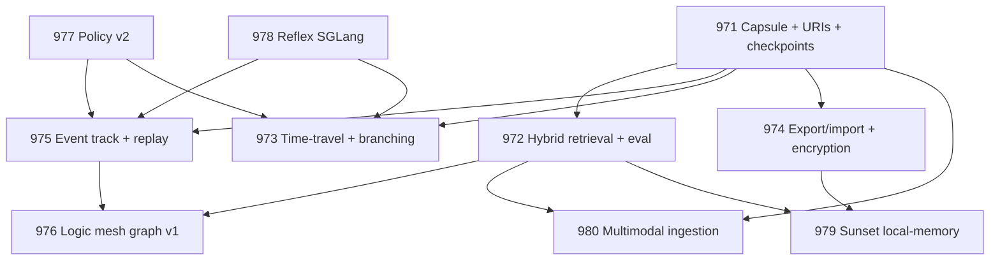

# Active Program (v1.0.0)

**Scope**: 2026-Q1 Memvid-First Workbench + Model Policy v2
**Last Updated**: 2026-01-28
**Status**: ACTIVE

***

## Table of Contents

* [Scope](#scope)
* [Active Specs](#active-specs)
  * [Foundation + Parallel Starts (Days 0-14)](#foundation--parallel-starts-days-0-14)
  * [Core Substrate (Days 14-30)](#core-substrate-days-14-30)
  * [Product UX (Days 30-60)](#product-ux-days-30-60)
  * [Higher-Level Intelligence (Days 45-75)](#higher-level-intelligence-days-45-75)
  * [Migration + Stretch (Days 60-90)](#migration--stretch-days-60-90)
* [Dependency DAG](#dependency-dag)
* [Sequencing + Gates](#sequencing--gates)
* [Definition of Done](#definition-of-done)
* [Archive Rule](#archive-rule)
* [Change History](#change-history)

## Scope

This document pins the **only** work considered "ACTIVE" for the 2026-Q1 program. If implementing something not referenced here (or in `SPEC.md`), stop and reconcile before coding.

***

## Active Specs

### Foundation + Parallel Starts (Days 0-14)

| Spec                                                             | Description                                   | Status    |
| ---------------------------------------------------------------- | --------------------------------------------- | --------- |
| [SPEC-KIT-971](./SPEC-KIT-971-memvid-capsule-foundation/spec.md) | Memvid Capsule Foundation                     | Completed |
| [SPEC-KIT-977](./SPEC-KIT-977-model-policy-v2/spec.md)           | Model Policy v2 (Governance + PolicySnapshot) | Completed |
| [SPEC-KIT-978](./SPEC-KIT-978-local-reflex-sglang/spec.md)       | Local Reflex (SGLang + Reflex Model Stack)    | Completed |

### Core Substrate (Days 14-30)

| Spec                                                         | Description                                        | Status    |
| ------------------------------------------------------------ | -------------------------------------------------- | --------- |
| [SPEC-KIT-972](./SPEC-KIT-972-hybrid-retrieval-eval/spec.md) | Hybrid Retrieval + Evaluation Harness              | Completed |
| [SPEC-KIT-975](./SPEC-KIT-975-replayable-audits/spec.md)     | Replayable Audits v1 (Event Track + Replay Engine) | Completed |

### Product UX (Days 30-60)

| Spec                                                                    | Description                              | Status    |
| ----------------------------------------------------------------------- | ---------------------------------------- | --------- |
| [SPEC-KIT-973](./SPEC-KIT-973-time-travel-ui/spec.md)                   | Time-Travel UI + Branching               | Completed |
| [SPEC-KIT-974](./SPEC-KIT-974-capsule-export-import-encryption/spec.md) | Export/Import + Encryption + Safe Export | Completed |

### Higher-Level Intelligence (Days 45-75)

| Spec                                                    | Description                                              | Status    |
| ------------------------------------------------------- | -------------------------------------------------------- | --------- |
| [SPEC-KIT-976](./SPEC-KIT-976-logic-mesh-graph/spec.md) | Logic Mesh / Graph v1 (Cards + Edges + Librarian Rebase) | Completed |

### Migration + Stretch (Days 60-90)

| Spec                                                        | Description                                                | Status    |
| ----------------------------------------------------------- | ---------------------------------------------------------- | --------- |
| [SPEC-KIT-979](./SPEC-KIT-979-local-memory-sunset/spec.md)  | Local-Memory Sunset (Parity gates → remove daemon)         | Completed |
| [SPEC-KIT-980](./SPEC-KIT-980-multimodal-ingestion/spec.md) | Multi-Modal Ingestion (PDF/DOCX first; CLIP/Whisper gated) | Pending   |

***

## Dependency DAG

***

## Sequencing + Gates

**Do not violate these gates.**

| Phase |  Days | Specs Allowed to Start    | "Don't Start Until" Gates                                   |
| ----: | ----: | ------------------------- | ----------------------------------------------------------- |
|     1 |  0-14 | 971, 977, 978             | —                                                           |
|     2 | 14-30 | 972, 975 (baseline)       | 971 URI contract + checkpoint listing tests passing         |
|     3 | 30-60 | 973, 974, 975 (full), 976 | 972 eval harness baseline + 975 event schema v1 merged      |
|     4 | 60-90 | 979, 980                  | 972 parity gates + export/import verification gates passing |

***

## Definition of Done

The program is complete when:

1. **Memvid is the system-of-record** (workspace capsule) for artifacts/evidence
2. **Every run is reproducible enough to audit**:
   * Retrieval + event timeline replay is deterministic offline
   * Model I/O replay depends on capture mode (defaults: summary+hash)
   * Exports are encrypted + safe by default
3. **Local-memory daemon is removed** only after parity gates are met

***

## Archive Rule

Everything not listed in [Active Specs](#active-specs) is either:

* Supporting reference, or
* **ARCHIVE** (historical specs, prior experiments, old ops docs)

When in doubt: treat as ARCHIVE until `SPEC.md` or this file says otherwise.

***

## Change History

| Version | Date       | Changes                                                              |
| ------- | ---------- | -------------------------------------------------------------------- |
| v1.0.2  | 2026-01-28 | SPEC-KIT-974 status updated to Completed                             |
| v1.0.1  | 2026-01-23 | DOC-001: Reconcile status markers with SPEC.md (9 specs → Completed) |
| v1.0.0  | 2026-01-22 | Initial canonical version (migrated from PROGRAM\_2026Q1\_ACTIVE.md) |

***

**Navigation**: [INDEX.md](INDEX.md) | [SPEC.md](../SPEC.md) | [KEY\_DOCS.md](KEY_DOCS.md)
