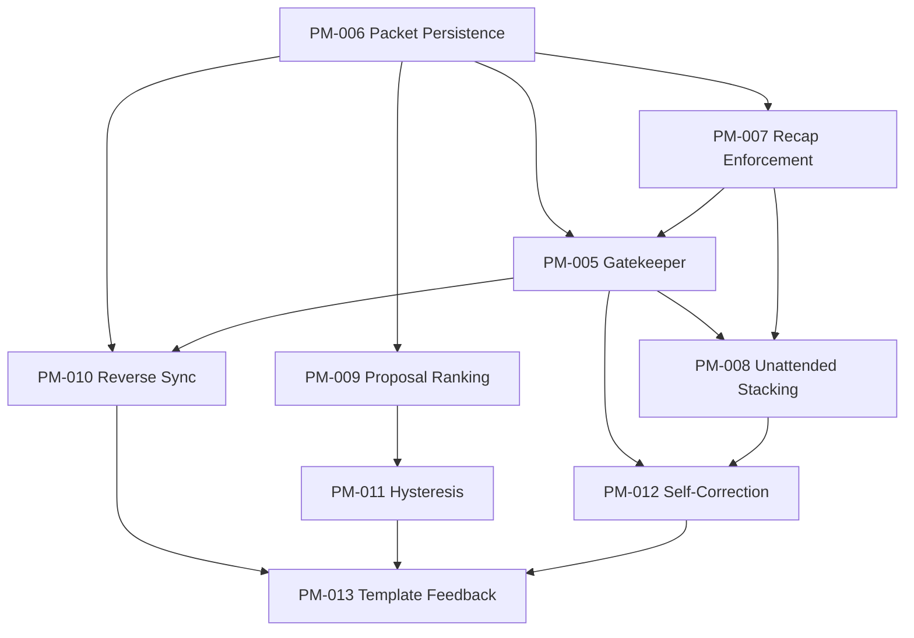

# Active Program (v2.0.0)

**Scope**: Epoch 1 - Consultant-First Packet-Driven Autonomy  
**Last Updated**: 2026-02-17  
**Status**: ACTIVE

***

## Program Contract Inputs

- `docs/VISION.md` (Version 1.1.0, Epoch 1)
- ADR set: `docs/adr/ADR-005-*.md` through `docs/adr/ADR-012-*.md`
- `memory/constitution.md` guardrails (`tui` primary, no second-system rewrite)
- `codex-rs/SPEC.md` canonical execution tracker

If implementation behavior conflicts with these inputs, treat as migration gap/regression and do not silently rewrite the contract.

***

## 30/60/90 Outcomes (Executable)

| Window | Outcome | SPEC Mapping | Status |
| --- | --- | --- | --- |
| Days 1-30 | Gatekeeper (Class 2 boundary + Class E bypass) | [SPEC-PM-005](./SPEC-PM-005-gatekeeper-class2-boundary/spec.md) | In Progress |
| Days 1-30 | Packet persistence (`.speckit/packet.yaml`) | [SPEC-PM-006](./SPEC-PM-006-packet-persistence/spec.md) | Planned |
| Days 1-30 | Recap enforcement (Explain before Act) | [SPEC-PM-007](./SPEC-PM-007-recap-enforcement/spec.md) | Planned |
| Days 31-60 | Unattended stacking + Morning Brief | [SPEC-PM-008](./SPEC-PM-008-unattended-stacking/spec.md) | Planned |
| Days 31-60 | Proposal ranking (Top 3 signal) | [SPEC-PM-009](./SPEC-PM-009-proposal-ranking-top3/spec.md) | Planned |
| Days 31-60 | Reverse Sync (code intent drift) | [SPEC-PM-010](./SPEC-PM-010-reverse-sync/spec.md) | Planned |
| Days 61-90 | Hysteresis engine | [SPEC-PM-011](./SPEC-PM-011-hysteresis-engine/spec.md) | Planned |
| Days 61-90 | Self-correction (retry before escalate) | [SPEC-PM-012](./SPEC-PM-012-self-correction/spec.md) | Planned |
| Days 61-90 | Template feedback loop | [SPEC-PM-013](./SPEC-PM-013-template-feedback/spec.md) | Planned |

***

## Active Specs by Phase

### Trust Foundation (Days 1-30)

| Spec | Description | Depends On |
| --- | --- | --- |
| [SPEC-PM-006](./SPEC-PM-006-packet-persistence/spec.md) | Durable packet contract + restart restore | - |
| [SPEC-PM-007](./SPEC-PM-007-recap-enforcement/spec.md) | Hard recap requirement for action shifts | PM-006 |
| [SPEC-PM-005](./SPEC-PM-005-gatekeeper-class2-boundary/spec.md) | Class 2 boundary gating + Class E override | PM-006, PM-007 |

### Autonomous Lab (Days 31-60)

| Spec | Description | Depends On |
| --- | --- | --- |
| [SPEC-PM-008](./SPEC-PM-008-unattended-stacking/spec.md) | Unattended progress with no merge | PM-005, PM-007 |
| [SPEC-PM-009](./SPEC-PM-009-proposal-ranking-top3/spec.md) | Ranked, bounded proposal inbox | PM-006 |
| [SPEC-PM-010](./SPEC-PM-010-reverse-sync/spec.md) | Code/packet drift detection and patch proposals | PM-006, PM-005 |

### Learning Loop (Days 61-90)

| Spec | Description | Depends On |
| --- | --- | --- |
| [SPEC-PM-011](./SPEC-PM-011-hysteresis-engine/spec.md) | Stability bias in plan replacement | PM-009 |
| [SPEC-PM-012](./SPEC-PM-012-self-correction/spec.md) | Build/test retries before escalation | PM-005, PM-008 |
| [SPEC-PM-013](./SPEC-PM-013-template-feedback/spec.md) | Promote successful patterns to templates | PM-010, PM-011, PM-012 |

***

## Dependency DAG

***

## Sequencing + Gates

| Phase | Days | Start Gate | Exit Gate |
| --- | --- | --- | --- |
| P0 Trust Foundation | 1-30 | Packet schema ratified | Gatekeeper + recap checks block invalid flows in Tier-1 surfaces |
| P1 Autonomous Lab | 31-60 | P0 exit gate passed | Unattended no-merge behavior + top-3 inbox + reverse-sync reports operational |
| P2 Learning Loop | 61-90 | P1 exit gate passed | Hysteresis, self-correction, and template feedback producing audited outcomes |

***

## Migration Notes (From Program v1.0.0)

- The previous 2026-Q1 memvid-first active plan is no longer this program's execution contract.
- Historical memvid specs remain historical artifacts; they are not active unless re-added to `codex-rs/SPEC.md` planned/in-progress tables.
- This migration is additive to running code: no parallel rewrite track is introduced.

***

## Definition of Done (Program)

- All nine roadmap deliverables have passing acceptance criteria in their SPEC packets.
- Tier-1 parity holds for gate/packet/recap behavior (TUI/CLI/headless).
- Unattended mode makes progress without merges.
- Learning loop reduces thrash and escalations with auditable evidence.

***

## Change History

| Version | Date | Changes |
| --- | --- | --- |
| v2.0.0 | 2026-02-17 | Replaced v1 memvid-first active plan with 30/60/90 contract aligned to VISION + ADR-005..012; added executable PM-005..PM-013 spec mapping. |
| v1.0.5 | 2026-01-29 | Last memvid-era update (historical). |

***

**Navigation**: [KEY_DOCS.md](KEY_DOCS.md) | [codex-rs/SPEC.md](../codex-rs/SPEC.md) | [VISION.md](VISION.md)
