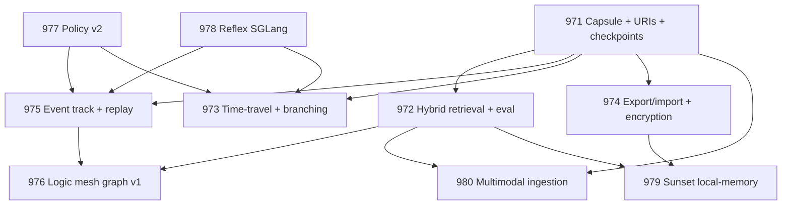

# 2026-Q1 Active Program: Memvid-First Workbench + Model Policy v2

This doc pins the **only** work that is considered “ACTIVE” for the 2026-Q1 program.
If you are implementing something and it is not referenced here (or in `SPEC.md`), stop and reconcile before coding.

## Active specs (in scope)

**Foundation + parallel starts (Days 0–14)**

- [SPEC-KIT-971 — Memvid Capsule Foundation](./SPEC-KIT-971-memvid-capsule-foundation/spec.md)
- [SPEC-KIT-977 — Model Policy v2 (Governance + PolicySnapshot)](./SPEC-KIT-977-model-policy-v2/spec.md)
- [SPEC-KIT-978 — Local Reflex (SGLang + Reflex Model Stack)](./SPEC-KIT-978-local-reflex-sglang/spec.md)

**Core substrate (Days 14–30)**

- [SPEC-KIT-972 — Hybrid Retrieval + Evaluation Harness](./SPEC-KIT-972-hybrid-retrieval-eval/spec.md)
- [SPEC-KIT-975 — Replayable Audits v1 (Event Track + Replay Engine)](./SPEC-KIT-975-replayable-audits/spec.md)

**Product UX (Days 30–60)**

- [SPEC-KIT-973 — Time-Travel UI + Branching](./SPEC-KIT-973-time-travel-ui/spec.md)
- [SPEC-KIT-974 — Export/Import + Encryption + Safe Export](./SPEC-KIT-974-capsule-export-import-encryption/spec.md)

**Higher-level intelligence (Days 45–75)**

- [SPEC-KIT-976 — Logic Mesh / Graph v1 (Cards + Edges + Librarian Rebase)](./SPEC-KIT-976-logic-mesh-graph/spec.md)

**Migration + stretch (Days 60–90)**

- [SPEC-KIT-979 — Local-Memory Sunset (Parity gates → remove daemon)](./SPEC-KIT-979-local-memory-sunset/spec.md)
- [SPEC-KIT-980 — Multi-Modal Ingestion (PDF/DOCX first; CLIP/Whisper gated)](./SPEC-KIT-980-multimodal-ingestion/spec.md)

## Dependency DAG (authoritative)

## Sequencing + gates (do not violate)

| Phase | Days | Specs allowed to start | “Don’t start until” gates |
|------:|-----:|-------------------------|----------------------------|
| 1 | 0–14 | 971, 977, 978 | — |
| 2 | 14–30 | 972, 975 (baseline) | 971 URI contract + checkpoint listing tests passing |
| 3 | 30–60 | 973, 974, 975 (full), 976 | 972 eval harness baseline + 975 event schema v1 merged |
| 4 | 60–90 | 979, 980 | 972 parity gates + export/import verification gates passing |

## What “done” means for the program

- **Memvid is the system-of-record** (workspace capsule) for artifacts/evidence.
- **Every run is reproducible enough to audit**:
  - retrieval + event timeline replay is deterministic offline,
  - model I/O replay depends on capture mode (defaults: summary+hash),
  - exports are encrypted + safe by default.
- **Local-memory daemon is removed** only after parity gates are met.

## Archive rule

Everything not listed above is either:
- supporting reference, or
- **ARCHIVE** (historical specs, prior experiments, old ops docs).

When in doubt: treat as ARCHIVE until `SPEC.md` / this file says otherwise.
