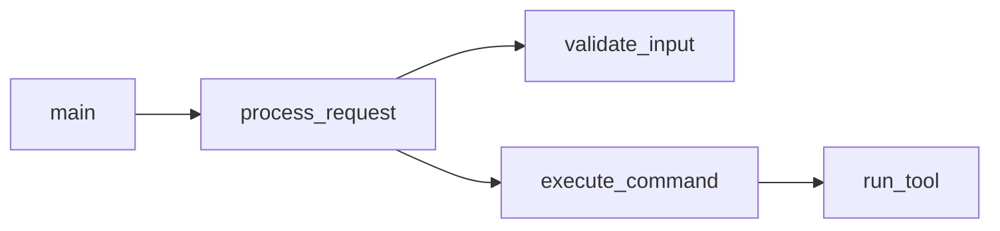

# P104 Continuation Prompt - Architect Sidecar Phase 3: CodeGraphContext MCP Integration

## Context

- **P103 Complete** (commit pending)
- Native Rust harvester implemented: `churn.rs`, `complexity.rs`, `skeleton.rs`
- Feature parity analysis complete against reference architecture
- CodeGraphContext MCP integration identified as P0 priority

---

## Session Objectives

### Primary: Full CodeGraphContext MCP Integration

Implement `codex-rs/core/src/architect/graph_bridge.rs` with actual MCP queries:

1. **Cyclomatic Complexity** via `mcp__CodeGraphContext__calculate_cyclomatic_complexity`
2. **Call Graph Analysis** via `mcp__CodeGraphContext__analyze_code_relationships`
3. **Dead Code Detection** via `mcp__CodeGraphContext__find_dead_code`
4. **Most Complex Functions** via `mcp__CodeGraphContext__find_most_complex_functions`

### Secondary: Mermaid.js Output Generation

Add call graph visualization to harvester output:



---

## Implementation Plan

### Step 1: Verify CodeGraphContext MCP Availability

```bash
# Check if Neo4j is running
docker ps | grep neo4j

# List indexed repositories
mcp__CodeGraphContext__list_indexed_repositories
```

### Step 2: Index codex-rs Repository

```bash
# If not indexed, add it
mcp__CodeGraphContext__add_code_to_graph path="/home/thetu/code/codex-rs"
mcp__CodeGraphContext__check_job_status job_id="<returned_id>"
```

### Step 3: Implement graph_bridge.rs

Replace stub implementations with actual MCP tool invocations:

```rust
// Current (stub):
pub async fn get_complexity(&self, function_name: &str) -> Result<Option<ComplexityInfo>>

// Target (MCP):
// 1. Invoke mcp__CodeGraphContext__calculate_cyclomatic_complexity
// 2. Parse response
// 3. Return ComplexityInfo struct
```

### Step 4: Add Mermaid Output to Harvester

New module: `codex-rs/core/src/architect/mermaid.rs`

- Convert call graph to Mermaid flowchart syntax
- Support multiple diagram types (flowchart, classDiagram)
- Output: `.codex/architect/ingest/call_graph.mmd`

### Step 5: Wire into CLI

Update `architect_cmd.rs`:
- Add `--graph` flag to include CodeGraphContext data
- Add `--mermaid` flag to generate visual outputs

---

## Files to Modify

| File | Changes |
|------|---------|
| `core/src/architect/graph_bridge.rs` | Full MCP implementation |
| `core/src/architect/mod.rs` | Add mermaid module export |
| `core/src/architect/mermaid.rs` | NEW: Mermaid generation |
| `cli/src/architect_cmd.rs` | Add --graph and --mermaid flags |

---

## Test Plan

1. **MCP Connectivity**
   ```bash
   ./codex-rs/target/dev-fast/code architect refresh --graph
   # Should query CodeGraphContext and report complexity metrics
   ```

2. **Mermaid Output**
   ```bash
   ./codex-rs/target/dev-fast/code architect refresh --mermaid
   cat .codex/architect/ingest/call_graph.mmd
   # Should contain valid Mermaid flowchart syntax
   ```

3. **NotebookLM Upload**
   - Upload generated `.mmd` file as source
   - Verify LLM can interpret call relationships

---

## Reference Architecture Alignment

After P104, our coverage:

| Stage | Reference | Status |
|-------|-----------|--------|
| 1. Structural Mapping | Repomix/Aider | Partial (skeleton.rs) |
| 2. Visualization | Sirens Call | **NEW** (mermaid.rs) |
| 3. Forensics | Hercules | Complete (churn.rs) |
| 4. Metrics | SCC/rust-code-analysis | **NEW** (graph_bridge.rs) |
| 5. Navigation | Stack Graphs | Future (P3) |
| 6. Integration | Pipeline | Complete |

---

## Pre-flight Checks

```bash
# Build
./build-fast.sh

# Verify architect CLI
./codex-rs/target/dev-fast/code architect status

# Check CodeGraphContext MCP
mcp__CodeGraphContext__list_indexed_repositories

# NotebookLM CLI (if needed)
export CHROME_PROFILE_DIR="/home/thetu/.config/chromium"
export NOTEBOOK_PROFILE_STRATEGY="single"
export HEADLESS="true"
node ~/notebooklm-mcp/dist/cli/index.js list-sources -n codex-rs-architect
```

---

## Key Files Reference

| File | Purpose |
|------|---------|
| `docs/ARCHITECT-FEATURE-PARITY.md` | Gap analysis vs reference |
| `codex-rs/core/src/architect/` | Harvester modules |
| `codex-rs/cli/src/architect_cmd.rs` | CLI implementation |
| `scripts/architect/generate_*.py` | Legacy Python (fallback) |

---

## Success Criteria

- [ ] CodeGraphContext queries return valid data
- [ ] Mermaid call graph generated for codex-rs
- [ ] `architect refresh --graph` completes without errors
- [ ] NotebookLM can interpret uploaded Mermaid diagrams
- [ ] Performance: native implementation faster than Python baseline
