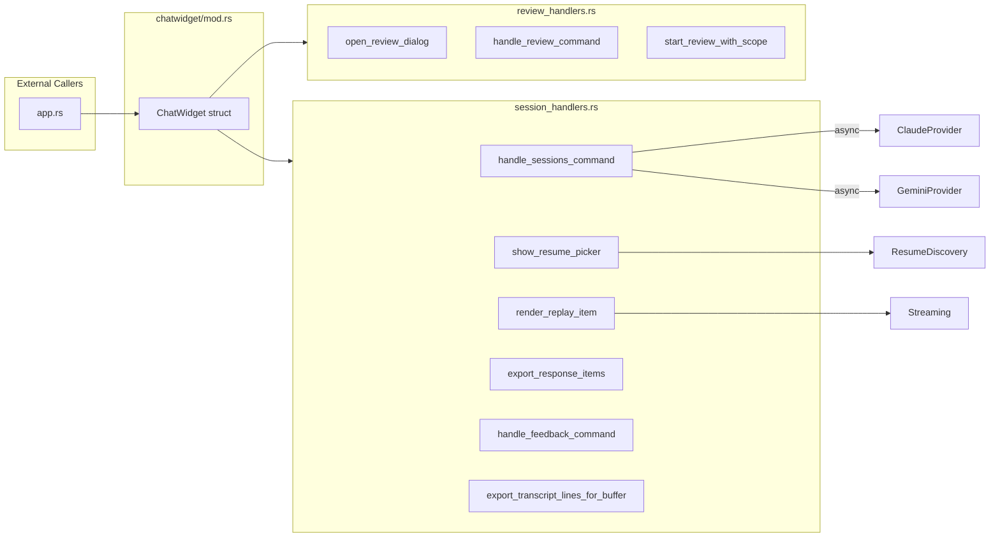

# ChatWidget Module Structure

Architecture diagram for the TUI chatwidget component (MAINT-11 Phase 8).

## Module Overview

```mermaid
graph TB
    subgraph ChatWidget["chatwidget/ (Core TUI)"]
        MOD[mod.rs<br/>~19,800 LOC<br/>Main widget logic]

        subgraph Extracted["MAINT-11 Extracted Modules"]
            AGENT_STATUS[agent_status.rs<br/>~130 LOC]
            CMD_RENDER[command_render.rs<br/>~340 LOC]
            INPUT_HELP[input_helpers.rs<br/>~200 LOC]
            REVIEW[review_handlers.rs<br/>~580 LOC]
            SESSION[session_handlers.rs<br/>~560 LOC]
            SUBMIT[submit_helpers.rs<br/>~380 LOC]
        end

        subgraph Original["Original Modules"]
            AGENT_INSTALL[agent_install.rs<br/>~870 LOC]
            AGENT[agent.rs<br/>~120 LOC]
            DIFF_H[diff_handlers.rs<br/>~230 LOC]
            DIFF_UI[diff_ui.rs<br/>~20 LOC]
            EXEC[exec_tools.rs<br/>~1,000 LOC]
            GH[gh_actions.rs<br/>~360 LOC]
            HELP[help_handlers.rs<br/>~90 LOC]
            HISTORY[history_render.rs<br/>~180 LOC]
            INTERRUPTS[interrupts.rs<br/>~250 LOC]
            LAYOUT[layout_scroll.rs<br/>~270 LOC]
            LIMITS_H[limits_handlers.rs<br/>~130 LOC]
            LIMITS_O[limits_overlay.rs<br/>~250 LOC]
            MESSAGE[message.rs<br/>~50 LOC]
            PERF[perf.rs<br/>~210 LOC]
            RATE[rate_limit_refresh.rs<br/>~140 LOC]
            STREAMING[streaming.rs<br/>~70 LOC]
            TERMINAL[terminal.rs<br/>~920 LOC]
            TERMINAL_H[terminal_handlers.rs<br/>~270 LOC]
            TOOLS[tools.rs<br/>~130 LOC]
            SESSION_H[session_header.rs<br/>~10 LOC]
        end
    end

    MOD --> Extracted
    MOD --> Original

    classDef extracted fill:#90EE90,stroke:#333
    classDef original fill:#87CEEB,stroke:#333
    classDef main fill:#FFD700,stroke:#333

    class AGENT_STATUS,CMD_RENDER,INPUT_HELP,REVIEW,SESSION,SUBMIT extracted
    class AGENT_INSTALL,AGENT,DIFF_H,DIFF_UI,EXEC,GH,HELP,HISTORY,INTERRUPTS,LAYOUT,LIMITS_H,LIMITS_O,MESSAGE,PERF,RATE,STREAMING,TERMINAL,TERMINAL_H,TOOLS,SESSION_H original
    class MOD main
```

## MAINT-11 Extraction History

| Session | Module | LOC Extracted | mod.rs After |
|---------|--------|---------------|--------------|
| P110 | command_render.rs | ~200 | 23,213 |
| P113 | agent_status.rs | ~65 | 23,151 |
| P114 | submit_helpers.rs | ~300 | 22,911 |
| P115 | (dead code cleanup) | -5 | 22,906 |
| P116 | input_helpers.rs | ~54 | 22,852 |
| P117 | (browser/chrome removal) | -2,094 | 20,758 |
| P118 | review_handlers.rs | ~408 | 20,350 |
| **P119** | **session_handlers.rs** | **~558** | **19,792** |

## Module Dependencies

## session_handlers.rs Contents

Functions extracted in P119:

| Function | Purpose | Lines |
|----------|---------|-------|
| `human_ago` | Format relative timestamps | 23 |
| `list_cli_sessions_impl` | List active CLI sessions | 60 |
| `kill_cli_session_impl` | Kill specific session | 25 |
| `kill_all_cli_sessions_impl` | Kill all sessions | 25 |
| `handle_sessions_command` | Handle /sessions command | 25 |
| `show_resume_picker` | Show resume session UI | 40 |
| `render_replay_item` | Render replayed items | 120 |
| `export_response_items` | Export history as ResponseItems | 35 |
| `handle_feedback_command` | Export session logs | 55 |
| `export_transcript_lines_for_buffer` | Export transcript | 25 |
| `render_lines_for_terminal` | Helper for terminal render | 25 |
| Tests | Unit tests for human_ago | 40 |

## Progress Metrics

| Metric | Start | Current | Target | Progress |
|--------|-------|---------|--------|----------|
| mod.rs LOC | 23,413 | 19,792 | <15,000 | 43% |
| Extracted modules | 0 | 6 | ~10 | 60% |
| Cumulative reduction | - | -3,621 | -8,413 | 43% |

## Remaining Extraction Candidates

| Target | Est. LOC | Complexity | Priority |
|--------|----------|------------|----------|
| agents_terminal | ~300 | Low | P120 |
| history_handlers | ~600 | Medium | P121 |
| event_handlers | ~1,000 | High | P122+ |
| config_handlers | ~400 | Medium | P123+ |

---

_Generated: 2025-12-16 (P119 Session)_
