# Spec-Auto Process Flow

Complete sequence diagram showing all stages, agents, and decision points.

## Mermaid Sequence Diagram

```mermaid
sequenceDiagram
    participant User
    participant Orchestrator as Spec-Auto Orchestrator<br/>(gpt-5-codex)
    participant Guardrail as Guardrail Script<br/>(bash)
    participant PolicyPre as Policy Prefilter<br/>(gpt-5-codex)
    participant PolicyFinal as Policy Final<br/>(gpt-5)
    participant HAL as HAL Validation<br/>(http checks)
    participant Gemini as Gemini Agent<br/>(gemini-2.5-pro)
    participant Claude as Claude Agent<br/>(claude-4.5-sonnet)
    participant GPT as GPT Agent<br/>(gpt-5)
    participant Arbiter as Arbiter Agent<br/>(gpt-5 high)
    participant FS as File System

    User->>Orchestrator: /spec-auto SPEC-ID

    Note over Orchestrator: STAGE 1: PLAN

    Orchestrator->>Guardrail: bash spec_ops_plan.sh SPEC-ID
    activate Guardrail

    Guardrail->>PolicyPre: Policy prefilter check
    activate PolicyPre
    PolicyPre->>PolicyPre: Read constitution.md, PRD, plan
    PolicyPre->>PolicyPre: Validate compliance
    PolicyPre-->>Guardrail: ✓ passed / ✗ failed
    deactivate PolicyPre

    Guardrail->>Guardrail: Run baseline audit
    Guardrail->>FS: Write baseline_<timestamp>.md

    Guardrail->>HAL: Health check (if secrets available)
    activate HAL
    HAL->>HAL: GET /health
    HAL->>HAL: GET /api/v3/movie
    HAL->>HAL: POST /api/v3/indexer/test
    HAL-->>Guardrail: ✓ passed / ⚠ skipped
    deactivate HAL

    Guardrail->>PolicyFinal: Policy final check
    activate PolicyFinal
    PolicyFinal->>PolicyFinal: Final compliance review
    PolicyFinal-->>Guardrail: ✓ passed / ✗ failed
    deactivate PolicyFinal

    Guardrail->>FS: Write spec-plan_<timestamp>.json (telemetry)
    Guardrail->>FS: Write spec-plan_<timestamp>.log
    Guardrail-->>Orchestrator: Exit 0 (success) / Exit 1 (failure)
    deactivate Guardrail

    alt Guardrail Failed
        Orchestrator->>User: ✗ Guardrail plan failed (exit 1)<br/>Pipeline halted
    else Guardrail Passed

        Note over Orchestrator: Multi-agent consensus

        Orchestrator->>Gemini: agent_run name=gemini-plan<br/>prompt: Research SPEC-ID
        activate Gemini
        Gemini->>Gemini: Read spec.md, PRD.md, plan.md
        Gemini->>Gemini: Survey requirements, gaps, risks
        Gemini->>FS: Write gemini result to .code/agents/<uuid>/result.txt
        Gemini-->>Orchestrator: JSON: research_summary, questions
        deactivate Gemini

        Orchestrator->>Claude: agent_run name=claude-plan<br/>prompt: Synthesize + Gemini output
        activate Claude
        Claude->>Claude: Read Gemini output
        Claude->>Claude: Create work breakdown
        Claude->>FS: Write claude result to .code/agents/<uuid>/result.txt
        Claude-->>Orchestrator: JSON: work_breakdown, acceptance_mapping, risks
        deactivate Claude

        Orchestrator->>GPT: agent_run name=gpt-plan<br/>prompt: Validate + all outputs
        activate GPT
        GPT->>GPT: Read Gemini + Claude outputs
        GPT->>GPT: Validate feasibility, extract consensus
        GPT->>FS: Write gpt result to .code/agents/<uuid>/result.txt
        GPT-->>Orchestrator: JSON: feasibility_notes, final_plan, consensus
        deactivate GPT

        Orchestrator->>Orchestrator: Compare outputs<br/>Extract agreements & conflicts

        alt Conflicts Detected
            Note over Orchestrator: Automatic conflict resolution

            Orchestrator->>Arbiter: agent_run name=arbiter-plan<br/>All outputs + conflicts
            activate Arbiter
            Arbiter->>Arbiter: Analyze disagreements
            Arbiter->>Arbiter: Choose best approach
            Arbiter->>FS: Write arbiter result to .code/agents/<uuid>/result.txt
            Arbiter-->>Orchestrator: Decision + rationale
            deactivate Arbiter

            Orchestrator->>Orchestrator: Apply arbiter decision
            Orchestrator->>FS: Write synthesis.json<br/>status=ok (arbiter resolved)

        else No Conflicts
            Orchestrator->>FS: Write synthesis.json<br/>status=ok
        end

        alt Arbiter Couldn't Resolve (Rare)
            Orchestrator->>Orchestrator: Check for majority position
            alt Majority Exists
                Orchestrator->>FS: Write synthesis.json<br/>status=ok (majority)
                Note over Orchestrator: Document dissent, proceed
            else True Deadlock
                Orchestrator->>FS: Write synthesis.json<br/>status=conflict (deadlock)
                Orchestrator->>User: ✗ Unresolvable conflict in plan<br/>Pipeline halted
            end
        else Consensus OK
            Orchestrator->>User: ✓ Plan consensus validated
        end
    end

    Note over Orchestrator: STAGE 2: TASKS

    Orchestrator->>Guardrail: bash spec_ops_tasks.sh SPEC-ID
    activate Guardrail
    Guardrail->>PolicyPre: Policy prefilter
    PolicyPre-->>Guardrail: ✓/✗
    Guardrail->>HAL: Health checks
    HAL-->>Guardrail: ✓/⚠
    Guardrail->>PolicyFinal: Policy final
    PolicyFinal-->>Guardrail: ✓/✗
    Guardrail->>FS: Write spec-tasks_<timestamp>.json
    Guardrail-->>Orchestrator: Exit 0/1
    deactivate Guardrail

    alt Success
        Orchestrator->>Gemini: agent_run gemini-tasks
        Gemini-->>Orchestrator: Task surfaces, dependencies
        Orchestrator->>Claude: agent_run claude-tasks
        Claude-->>Orchestrator: Task breakdown
        Orchestrator->>GPT: agent_run gpt-tasks
        GPT-->>Orchestrator: Validated tasks, consensus

        alt Conflicts
            Orchestrator->>Arbiter: Resolve task disagreements
            Arbiter-->>Orchestrator: Resolution
        end

        Orchestrator->>FS: Write synthesis.json (tasks)
        Orchestrator->>User: ✓ Tasks consensus validated
    end

    Note over Orchestrator: STAGE 3: IMPLEMENT

    Orchestrator->>Guardrail: bash spec_ops_implement.sh SPEC-ID
    activate Guardrail
    Guardrail->>PolicyPre: Policy prefilter
    Guardrail->>HAL: Health checks
    Guardrail->>PolicyFinal: Policy final
    Guardrail->>FS: Write spec-implement_<timestamp>.json
    Guardrail-->>Orchestrator: Exit 0/1
    deactivate Guardrail

    alt Success
        Note over Orchestrator: Uses GPT-Codex for implementation
        Orchestrator->>Gemini: agent_run gemini-implement
        Gemini-->>Orchestrator: Code paths, edge cases
        Orchestrator->>Claude: agent_run claude-implement
        Claude-->>Orchestrator: Implementation strategy
        Orchestrator->>GPT: agent_run gpt-codex-implement<br/>(gpt-5-codex high reasoning)
        GPT-->>Orchestrator: Code diffs, validation plan

        alt Conflicts
            Orchestrator->>Arbiter: Resolve implementation approach
            Arbiter-->>Orchestrator: Resolution
        end

        Orchestrator->>FS: Write synthesis.json (implement)
        Orchestrator->>User: ✓ Implement consensus validated
    end

    Note over Orchestrator: STAGE 4: VALIDATE

    Orchestrator->>Guardrail: bash spec_ops_validate.sh SPEC-ID
    activate Guardrail
    Guardrail->>PolicyPre: Policy prefilter
    Guardrail->>HAL: Health checks
    Guardrail->>PolicyFinal: Policy final
    Guardrail->>FS: Write spec-validate_<timestamp>.json
    Guardrail-->>Orchestrator: Exit 0/1
    deactivate Guardrail

    alt Success
        Orchestrator->>Gemini: agent_run gemini-validate
        Gemini-->>Orchestrator: Validation scenarios
        Orchestrator->>Claude: agent_run claude-validate
        Claude-->>Orchestrator: Test coverage
        Orchestrator->>GPT: agent_run gpt-validate
        GPT-->>Orchestrator: Validation verdict

        alt Conflicts
            Orchestrator->>Arbiter: Resolve validation approach
            Arbiter-->>Orchestrator: Resolution
        end

        Orchestrator->>FS: Write synthesis.json (validate)
        Orchestrator->>User: ✓ Validate consensus validated
    end

    Note over Orchestrator: STAGE 5: AUDIT

    Orchestrator->>Guardrail: bash spec_ops_audit.sh SPEC-ID
    activate Guardrail
    Guardrail->>PolicyPre: Policy prefilter
    Guardrail->>HAL: Health checks
    Guardrail->>PolicyFinal: Policy final
    Guardrail->>FS: Write spec-audit_<timestamp>.json
    Guardrail-->>Orchestrator: Exit 0/1
    deactivate Guardrail

    alt Success
        Orchestrator->>Gemini: agent_run gemini-audit
        Gemini-->>Orchestrator: Audit findings
        Orchestrator->>Claude: agent_run claude-audit
        Claude-->>Orchestrator: Go/no-go assessment
        Orchestrator->>GPT: agent_run gpt-audit
        GPT-->>Orchestrator: Final audit verdict

        alt Conflicts
            Orchestrator->>Arbiter: Resolve audit decision
            Arbiter-->>Orchestrator: Resolution
        end

        Orchestrator->>FS: Write synthesis.json (audit)
        Orchestrator->>User: ✓ Audit consensus validated
    end

    Note over Orchestrator: STAGE 6: UNLOCK

    Orchestrator->>Guardrail: bash spec_ops_unlock.sh SPEC-ID
    activate Guardrail
    Guardrail->>PolicyPre: Policy prefilter
    Guardrail->>HAL: Health checks
    Guardrail->>PolicyFinal: Policy final
    Guardrail->>FS: Write spec-unlock_<timestamp>.json
    Guardrail-->>Orchestrator: Exit 0/1
    deactivate Guardrail

    alt Success
        Orchestrator->>Gemini: agent_run gemini-unlock
        Gemini-->>Orchestrator: Unlock justification
        Orchestrator->>Claude: agent_run claude-unlock
        Claude-->>Orchestrator: Final approval
        Orchestrator->>GPT: agent_run gpt-unlock
        GPT-->>Orchestrator: Unlock consensus

        alt Conflicts
            Orchestrator->>Arbiter: Resolve unlock decision
            Arbiter-->>Orchestrator: Resolution
        end

        Orchestrator->>FS: Write synthesis.json (unlock)
        Orchestrator->>User: ✓ Unlock consensus validated
    end

    Orchestrator->>User: ✅ Pipeline complete<br/>All 6 stages validated
```



## Agent Count Analysis

**Per Stage (if no conflicts):**
- 1 Policy Prefilter agent (gpt-5-codex)
- 1 Policy Final agent (gpt-5)
- 3 Consensus agents (gemini, claude, gpt)
- **Total: 5 agents/stage**

**Per Stage (with conflicts):**
- 5 base agents
- 1 Arbiter agent (gpt-5)
- **Total: 6 agents/stage**

**Full 6-Stage Pipeline:**
- No conflicts: 6 × 5 = **30 agents**
- All conflicts: 6 × 6 = **36 agents**
- Mixed: **30-36 agents typical**

**Your 20 agents:** Indicates partial run or some stages without conflicts ✓

## File Artifacts Per Stage

**Guardrail outputs:**
```
docs/SPEC-OPS-004-integrated-coder-hooks/evidence/commands/{SPEC-ID}/
  ├── baseline_{timestamp}.md
  ├── spec-{stage}_{timestamp}.json  ← Telemetry
  └── spec-{stage}_{timestamp}.log   ← Execution log
```

**Consensus outputs:**
```
docs/SPEC-OPS-004-integrated-coder-hooks/evidence/consensus/{SPEC-ID}/
  ├── spec-{stage}_{timestamp}_gemini.json
  ├── spec-{stage}_{timestamp}_claude.json
  ├── spec-{stage}_{timestamp}_gpt_pro.json
  ├── spec-{stage}_{timestamp}_synthesis.json  ← Consensus result
  └── spec-{stage}_{timestamp}_telemetry.jsonl
```

**Agent work directories:**
```
.code/agents/{uuid}/
  └── result.txt  ← Agent output
```

## Decision Points (Where Pipeline Can Halt)

**Per Stage:**
1. **Guardrail fails** (exit 1) → HALT
   - Baseline audit failed
   - Policy check rejected
   - HAL validation failed

2. **Agent spawn fails** → HALT
   - Model not available
   - Agent crashed

3. **True deadlock** (rare) → HALT
   - Agents disagree
   - Arbiter can't decide
   - No majority position

**Otherwise:** Auto-advances to next stage

## Success Path (Typical)

```
User: /spec-auto SPEC-ID
  ↓
Stage 1 (Plan):
  Guardrail: baseline ✓, policy ✓, HAL ✓
  Agents: gemini ✓, claude ✓, gpt ✓
  Consensus: 15 agreements, 2 conflicts
  Arbiter: Resolves conflicts → status=ok
  ✓ Advances
  ↓
Stage 2 (Tasks):
  Guardrail: ✓
  Agents: gemini ✓, claude ✓, gpt ✓
  Consensus: 12 agreements, 0 conflicts
  ✓ Advances
  ↓
Stage 3 (Implement):
  Guardrail: ✓
  Agents: gemini ✓, claude ✓, gpt-codex ✓
  Consensus: 8 agreements, 1 conflict
  Arbiter: Resolves → status=ok
  ✓ Advances
  ↓
Stage 4 (Validate):
  Guardrail: ✓
  Agents: gemini ✓, claude ✓, gpt ✓
  Consensus: 10 agreements, 0 conflicts
  ✓ Advances
  ↓
Stage 5 (Audit):
  Guardrail: ✓
  Agents: gemini ✓, claude ✓, gpt ✓
  Consensus: 6 agreements, 0 conflicts
  ✓ Advances
  ↓
Stage 6 (Unlock):
  Guardrail: ✓
  Agents: gemini ✓, claude ✓, gpt ✓
  Consensus: 4 agreements, 0 conflicts
  ✓ Complete
  ↓
User: ✅ Pipeline complete (all stages validated)
```

## Failure Scenarios

### Scenario 1: Guardrail Fails (Stage 3)

```
Stage 1: ✓
Stage 2: ✓
Stage 3: Guardrail → Policy Final → ✗ REJECTED
  ↓
Pipeline HALTS
User sees: "✗ Guardrail implement failed with exit code 1"
Next: Fix policy issue, resume with:
      /spec-auto SPEC-ID --from implement
```

### Scenario 2: True Deadlock (Stage 2)

```
Stage 1: ✓
Stage 2:
  Agents: gemini, claude, gpt complete
  Consensus: 5 agreements, 3 conflicts
  Arbiter: Spawned → Can't decide (conflicting constraints)
  Majority check: No majority (50/50 split)
  ↓
Pipeline HALTS
User sees: "✗ Unresolvable conflict in tasks"
Next: Manual resolution required
```

### Scenario 3: Agent Unavailable

```
Stage 1:
  Guardrail: ✓
  Gemini: ✓
  Claude: ✗ Model not available / API error
  ↓
Pipeline HALTS (degraded)
User sees: "✗ Claude agent failed - cannot proceed with degraded consensus"
Next: Configure claude agent, retry
```

## Orchestrator Logic Flow

```
FOR each stage in [plan, tasks, implement, validate, audit, unlock]:

  1. Execute guardrail bash script
     IF exit != 0: HALT with error

  2. Read prompts.json for spec-{stage}
     Extract: gemini.prompt, claude.prompt, gpt.prompt

  3. Build context:
     Read: spec.md, PRD.md, product-requirements.md, PLANNING.md

  4. Spawn agents sequentially:
     gemini → wait → collect result
     claude (+ gemini output) → wait → collect
     gpt (+ all outputs) → wait → collect

  5. Compare agent outputs:
     Extract consensus.agreements
     Extract consensus.conflicts

  6. IF conflicts exist:
       Spawn arbiter with all outputs + conflicts
       Arbiter decides best approach
       Use arbiter decision as consensus
       Document arbiter resolution

     IF arbiter uncertain:
       Check majority position
       IF majority: use it, document dissent
       ELSE: HALT (true deadlock)

  7. Write synthesis.json:
     status = ok (resolved) | conflict (deadlock)
     consensus = {agreements, conflicts, arbiter_decision}

  8. IF status == ok:
       Continue to next stage
     ELSE:
       HALT, show unresolvable conflict

END LOOP

Report: "Pipeline complete"
```

## Current Implementation Status

**✅ Implemented:**
- All 6 guardrail scripts
- Multi-agent prompts (prompts.json)
- Orchestrator delegation (Rust enum → subagent command)
- Automatic conflict resolution (arbiter spawning)
- Synthesis writing
- Auto-advancement logic

**✅ Visible in TUI:**
- Bash guardrail execution
- Agent spawning messages
- Agent progress
- Consensus results
- Arbiter decisions

**⚠️ Not Yet Tested:**
- Full 6-stage completion
- Arbiter resolution across multiple stages
- HAL validation (if secrets available)

**❌ Known Gap:**
- Guardrail substeps not individually visible (bash runs as single block)
- Can see output but not "✓ Baseline passed" → "✓ Policy passed" transitions

## Validation Checklist

To verify implementation matches diagram:

**Agent Spawning:**
- [ ] Policy checks spawn gpt-5-codex
- [ ] Consensus spawns gemini-2.5-pro, claude-4.5-sonnet, gpt-5
- [ ] Arbiter spawns gpt-5 with high reasoning
- [ ] ~5-6 agents per stage (30-36 total)

**Files Written:**
- [ ] Guardrail telemetry: `spec-{stage}_{timestamp}.json`
- [ ] Consensus synthesis: `spec-{stage}_{timestamp}_synthesis.json`
- [ ] Per-agent outputs: `.code/agents/{uuid}/result.txt`
- [ ] Baseline audits: `baseline_{timestamp}.md`

**Decision Logic:**
- [ ] Guardrail fail → halt
- [ ] Conflicts → arbiter spawns automatically
- [ ] Arbiter resolves → status=ok, continue
- [ ] True deadlock → halt (rare)
- [ ] Success → auto-advance to next stage

**To test:** Run `/spec-auto SPEC-KIT-048-test-full-pipeline` and verify all checkboxes.

---

## Questions This Diagram Answers

1. **Why 20 agents?**
   - 6 stages × ~3-4 agents = 18-24 (normal)

2. **Which models spawn when?**
   - Policy: gpt-5-codex, gpt-5
   - Consensus: gemini, claude, gpt (or gpt-codex for implement)
   - Arbiter: gpt-5 high reasoning

3. **Where do conflicts get resolved?**
   - After each stage's consensus
   - Before writing synthesis.json
   - Auto-resolution via arbiter (not manual)

4. **When does it halt?**
   - Guardrail failure (exit 1)
   - Agent failure (model unavailable)
   - True deadlock (arbiter + majority both fail)

5. **What files get written?**
   - Per stage: telemetry, synthesis, logs, baselines
   - Per agent: result.txt in .code/agents/

---

## Next: Verify Against Reality

**Run full pipeline:**
```bash
/new-spec Test full pipeline validation
/spec-auto SPEC-KIT-048-test-full-pipeline-validation
```

**Then analyze:**
```bash
bash scripts/spec_ops_004/log_agent_runs.sh 60
```

**Compare with diagram:**
- Agent count matches expected?
- Models match (gemini, claude, gpt mix)?
- Files written in expected locations?
- Conflicts auto-resolved?

**Report discrepancies** → Update diagram or fix implementation.
